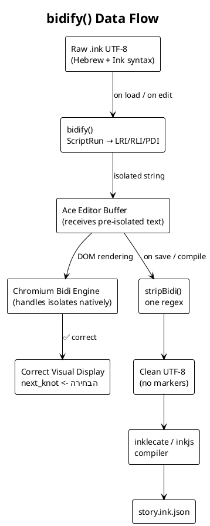
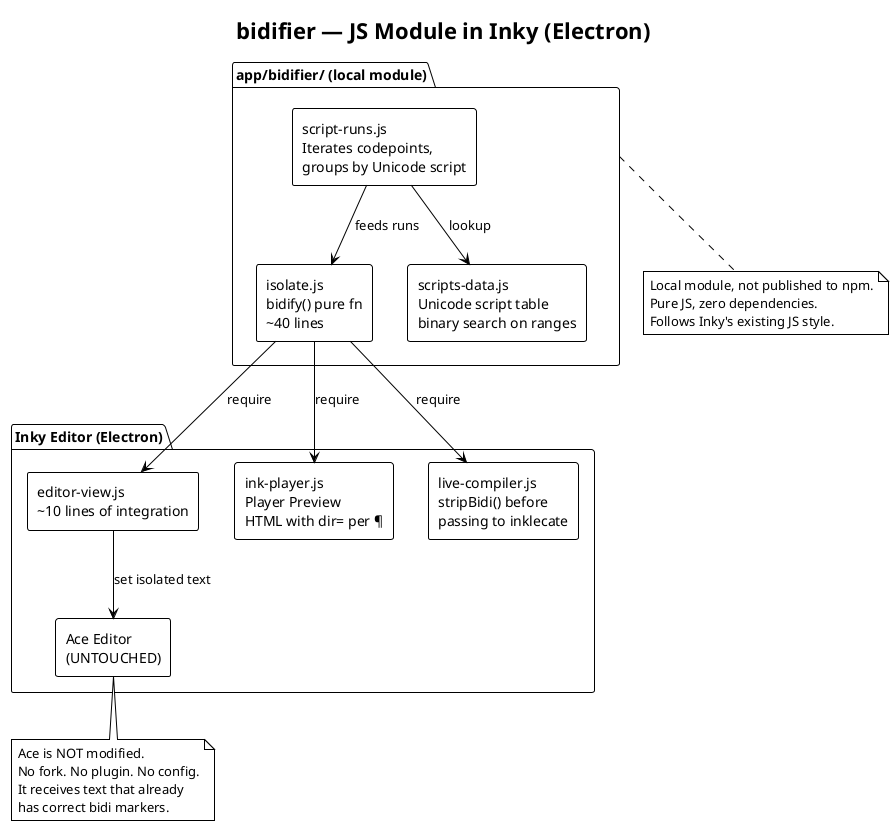
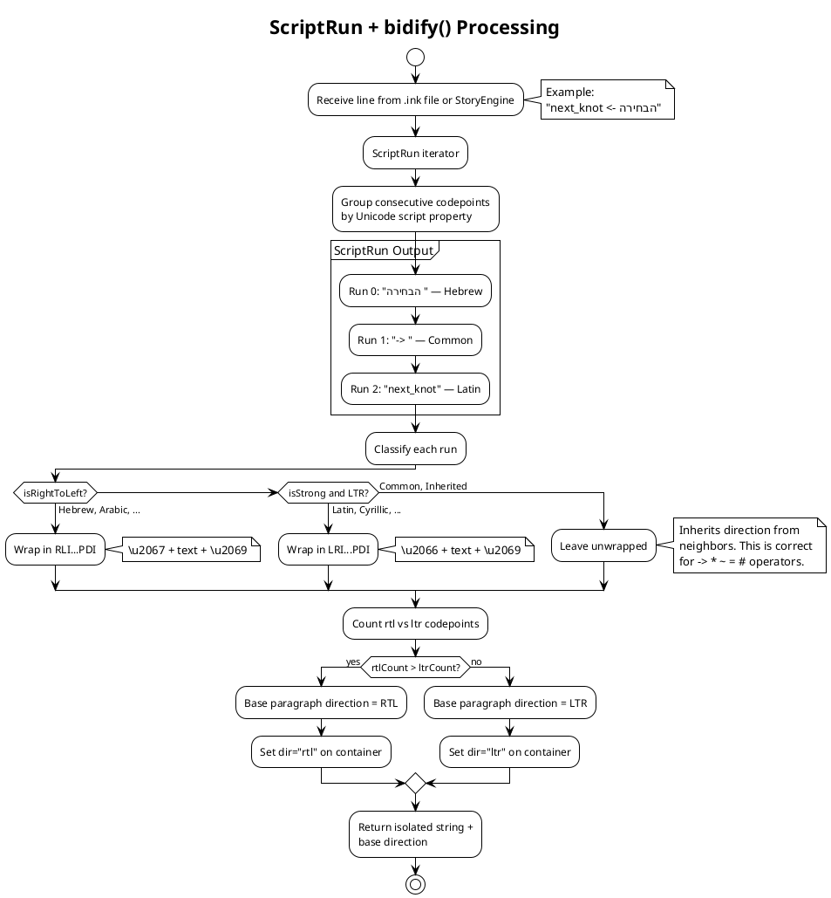
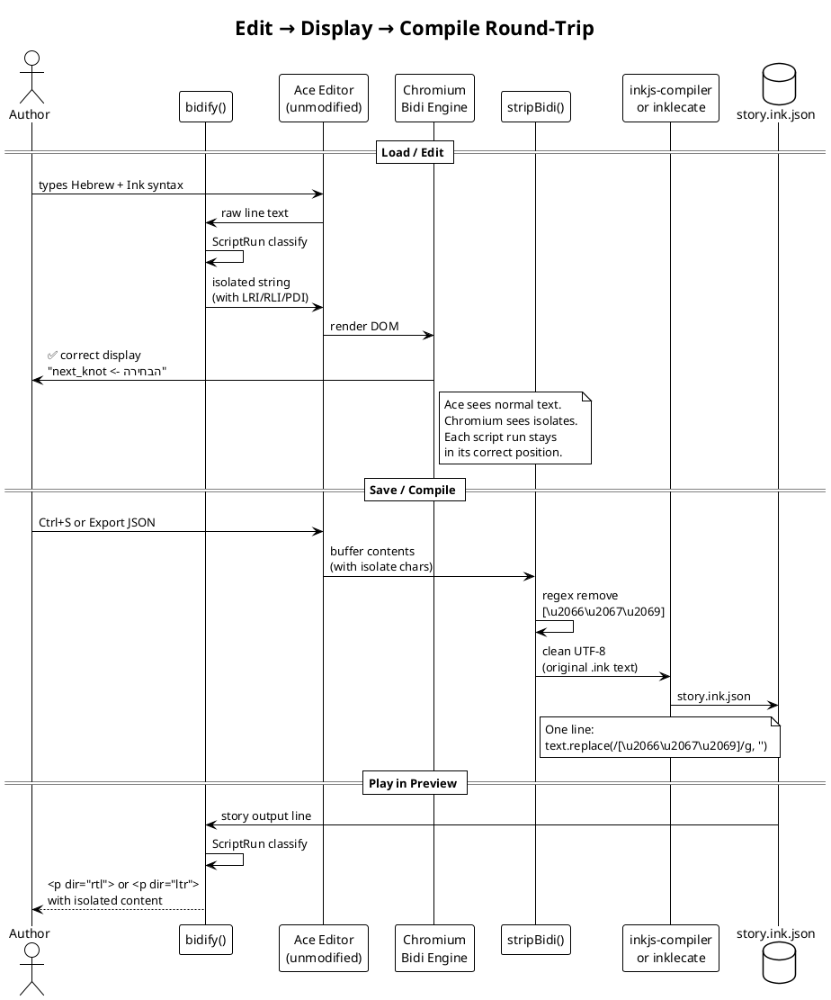
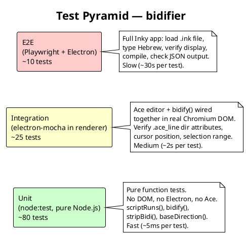

# bidifier — UTF Bidi Preprocessor for Ink Narrative Engine
> **bidify** /ˈbɪd.ɪ.faɪ/ *v.* — beautify bidi by injecting invisible
> yet needed Unicode markers that the keyboard doesn't have.
> The characters exist in the standard (LRI U+2066, RLI U+2067, PDI U+2069).
> The user can't type them. The editor doesn't add them. `bidify()` does.
> **Fixes:** [inkle/inky#122 — Cannot use Right-to-Left languages (Arabic, Persian) with Inky properly](https://github.com/inkle/inky/issues/122)
> Open since **2017**. No Ace fork. No Ink syntax change. One preprocessor.
## Fork Scope: inkle/inky

File | Change | Lines
-- | -- | --
app/renderer/editor-view.js | Intercept text → bidify() before Ace session | ~10
app/renderer/editor-view.js | Set dir attribute on .ace_line per base direction | ~5
app/renderer/ink-player.js | Wrap story output with bidify() before preview DOM | ~5
app/renderer/live-compiler.js | Call stripBidi() before passing buffer to inklecate | ~3
package.json | Add "bidifier": "^1.0.0" | 1
Total | 5 files, ~25 lines. Ace untouched. |  


Testing roughly doubles the effort but provides: a regression safety net for the
upstream PR, proof that the bidifier is invisible to the compiler, and screenshot
evidence of the fix for issue #122.

---
## Key Principle
> **The bidifier is a lens, not a patch.**
> It doesn't change the text. It doesn't change the editor.
> It adds invisible markers that tell the rendering engine
> what it should have been able to figure out on its own
> if every character carried its script identity.
> ScriptRun provides that identity. LRI/RLI/PDI express it.</p>
> <p>**bidify** = beautify bidi. The markers exist in Unicode since 2013.
> The keyboard doesn't have them. The editor doesn't add them.
> `bidify()` does.# bidifier — UTF Bidi Preprocessor for Ink Narrative Engine

> **bidify** /ˈbɪd.ɪ.faɪ/ *v.* — beautify bidi by injecting invisible
> yet needed Unicode markers that the keyboard doesn't have.
> The characters exist in the standard (LRI U+2066, RLI U+2067, PDI U+2069).
> The user can't type them. The editor doesn't add them. `bidify()` does.

> **Fixes:** [[inkle/inky#122 — Cannot use Right-to-Left languages (Arabic, Persian) with Inky properly](https://github.com/inkle/inky/issues/122)](https://github.com/inkle/inky/issues/122)
> Open since **2017**. No Ace fork. No Ink syntax change. One preprocessor.

## Fork Scope: inkle/inky

| File | Change | Lines |
|------|--------|-------|
| `app/renderer/editor-view.js` | Intercept text → `bidify()` before Ace session | ~10 |
| `app/renderer/editor-view.js` | Set `dir` attribute on `.ace_line` per base direction | ~5 |
| `app/renderer/ink-player.js` | Wrap story output with `bidify()` before preview DOM | ~5 |
| `app/renderer/live-compiler.js` | Call `stripBidi()` before passing buffer to inklecate | ~3 |
| `package.json` | Add `"bidifier": "^1.0.0"` | 1 |
| **Total** | **5 files, ~25 lines. Ace untouched.** | |

If inkle merges it → unfork.

## Implementation Plan for Claude Code

### Prerequisites

```bash
# Clone the fork
git clone https://github.com/VRDate/inky.git
cd inky

# Install dependencies
cd app && npm install && cd ..
```

### Step 1: Create bidifier module (no external deps)

Create `app/bidifier/` as a local module inside the Inky repo.
This stays self-contained — no npm publish needed yet.

```
app/bidifier/
├── index.js          # exports { bidify, stripBidi, scriptRuns, baseDirection }
├── script-runs.js    # ScriptRun iterator — group codepoints by Unicode script
├── isolate.js        # bidify() — wrap runs in LRI/RLI/PDI
├── scripts-data.js   # Unicode script property table (generated from UCD)
└── package.json      # { "name": "bidifier", "main": "index.js" }
```

**script-runs.js** must:
- Iterate codepoints (handle surrogate pairs via `for...of` or `String.codePointAt`)
- Look up each codepoint's Unicode Script property from `scripts-data.js`
- Group consecutive codepoints with the same script into `ScriptRun` objects
- Each `ScriptRun` has: `{ start, end, text, script, isRtl, isStrong }`
- `isRtl` = true for: Hebrew, Arabic, Syriac, Thaana, NKo, Samaritan, Mandaic
- `isStrong` = true for any script that is NOT Common and NOT Inherited
- Common and Inherited runs are emitted but with `isRtl: false, isStrong: false`

**scripts-data.js** must:
- Export a function `getScript(codepoint: number): string`
- Cover at minimum these ranges (from Unicode 15.1 UCD):
  - Hebrew: U+0590–U+05FF, U+FB1D–U+FB4F
  - Arabic: U+0600–U+06FF, U+0750–U+077F, U+0870–U+089F, U+08A0–U+08FF,
    U+FB50–U+FDFF, U+FE70–U+FEFF
  - Syriac: U+0700–U+074F
  - Thaana: U+0780–U+07BF
  - NKo: U+07C0–U+07FF
  - Samaritan: U+0800–U+083F
  - Mandaic: U+0840–U+085F
  - Latin: U+0041–U+024F, U+1E00–U+1EFF
- Everything else defaults to "Common"
- Use range-based lookup (not a 1M-entry array) — binary search on sorted ranges

**isolate.js** must:
- Export `bidify(text: string): string`
- Export `stripBidi(text: string): string`
- Export `baseDirection(text: string): 'ltr' | 'rtl' | 'neutral'`
- `bidify`:
  - Call `scriptRuns(text)` to get runs
  - If only 1 run or 0 strong runs → return text unchanged
  - For each run:
    - `isRtl` → prepend `\u2067` (RLI), append `\u2069` (PDI)
    - `isStrong && !isRtl` → prepend `\u2066` (LRI), append `\u2069` (PDI)
    - else (Common/Inherited) → leave as-is
  - Return concatenated result
- `stripBidi`:
  - `return text.replace(/[\u2066\u2067\u2069]/g, '')`
- `baseDirection`:
  - Count RTL vs LTR codepoints from scriptRuns
  - Return majority

### Step 2: Create test infrastructure

Inky has NO existing test framework. `app/test/test.js` is empty/placeholder.
Set up minimal Node.js test runner.

```
app/test/
├── test.js                  # existing — replace with test runner entry point
├── bidi_test.ink            # the narrative test file (already provided)
├── bidifier.test.js     # unit tests for bidifier module
└── bidi-assertions.json     # expected ScriptRun output per test line
```

**package.json** — add to `"scripts"`:
```json
{
  "test": "node app/test/test.js",
  "test:bidi": "node app/test/bidifier.test.js"
}
```

**bidifier.test.js** must:
- Import `{ bidify, stripBidi, scriptRuns, baseDirection }` from `../bidifier`
- Load `bidi-assertions.json` which has this shape:
  ```json
  {
    "assertions": [
      {
        "id": "hebrew-period",
        "input": "שלום עולם.",
        "expectedDirection": "rtl",
        "expectedRuns": [
          { "text": "שלום עולם", "script": "Hebrew", "isRtl": true },
          { "text": ".", "script": "Common", "isRtl": false }
        ]
      },
      {
        "id": "hebrew-divert",
        "input": "הבחירה -> next",
        "expectedDirection": "rtl",
        "expectedRuns": [
          { "text": "הבחירה ", "script": "Hebrew", "isRtl": true },
          { "text": "-> ", "script": "Common", "isRtl": false },
          { "text": "next", "script": "Latin", "isRtl": false }
        ]
      },
      {
        "id": "arabic-divert",
        "input": "الاختيار -> next",
        "expectedDirection": "rtl",
        "expectedRuns": [
          { "text": "الاختيار ", "script": "Arabic", "isRtl": true },
          { "text": "-> ", "script": "Common", "isRtl": false },
          { "text": "next", "script": "Latin", "isRtl": false }
        ]
      },
      {
        "id": "persian-divert",
        "input": "انتخاب -> next",
        "expectedDirection": "rtl"
      },
      {
        "id": "urdu-period",
        "input": "ہیلو دنیا.",
        "expectedDirection": "rtl"
      },
      {
        "id": "yiddish-divert",
        "input": "די ברירה -> next",
        "expectedDirection": "rtl"
      },
      {
        "id": "syriac-period",
        "input": "ܫܠܡܐ ܥܠܡܐ.",
        "expectedDirection": "rtl"
      },
      {
        "id": "thaana-period",
        "input": "ހެލޯ ވޯލްޑް.",
        "expectedDirection": "rtl"
      },
      {
        "id": "nko-period",
        "input": "ߊߟߎ ߘߎߢߊ.",
        "expectedDirection": "rtl"
      },
      {
        "id": "samaritan-divert",
        "input": "ࠁࠇࠓࠕ -> next",
        "expectedDirection": "rtl"
      },
      {
        "id": "mandaic-period",
        "input": "ࡔࡋࡀࡌࡀ.",
        "expectedDirection": "rtl"
      },
      {
        "id": "pure-english",
        "input": "The clock reads 3:47 AM.",
        "expectedDirection": "ltr"
      },
      {
        "id": "emoji-hebrew-mixed",
        "input": "🧑 \"סוֹף סוֹף... גָּמַרְתִּי.\"",
        "expectedDirection": "rtl"
      },
      {
        "id": "ink-choice-hebrew",
        "input": "* [בחירה ראשונה — ממשיכים הלאה]",
        "expectedDirection": "rtl"
      },
      {
        "id": "ink-variable-hebrew",
        "input": "~ attempts = attempts + 1",
        "expectedDirection": "ltr"
      },
      {
        "id": "ink-tag-hebrew-value",
        "input": "# BGM: BGM_V1_LEVEL_START",
        "expectedDirection": "ltr"
      },
      {
        "id": "strip-roundtrip",
        "input": "הבחירה -> next",
        "note": "bidify then stripBidi must return original"
      }
    ]
  }
  ```
- For each assertion:
  - `scriptRuns(input)` matches `expectedRuns` (if provided)
  - `baseDirection(input)` matches `expectedDirection`
  - `stripBidi(bidify(input))` === `input` (round-trip)
  - `bidify(input)` contains no adjacent LRI/RLI without text between them
- Use Node.js built-in `assert` module — no test framework dependency
- Print pass/fail per assertion, exit code 1 on any failure

### Step 3: Integrate into Inky editor (5 files, ~25 lines)

**app/renderer/editor-view.js** — two changes:

1. After text is set in Ace session, run through bidify:
   ```js
   const { bidify, baseDirection } = require('../bidifier');

   // In the method that updates Ace content:
   // For each line in the document, apply bidi isolation
   // Hook session.on('change', ...) to re-process changed lines
   ```

2. Set `dir` attribute on `.ace_line` elements:
   ```js
   // After processing, for each line element:
   // lineEl.style.direction = baseDirection(lineText) === 'rtl' ? 'rtl' : 'ltr';
   // lineEl.style.textAlign = baseDirection(lineText) === 'rtl' ? 'right' : 'left';
   ```

**app/renderer/ink-player.js** — one change:

   Wrap story output text through bidify before inserting in DOM:
   ```js
   const { bidify, baseDirection } = require('../bidifier');

   // In the method that displays story text:
   // text = bidify(text);
   // Set dir attribute on paragraph element based on baseDirection
   ```

**app/renderer/live-compiler.js** — one change:

   Strip bidi markers before sending to inklecate:
   ```js
   const { stripBidi } = require('../bidifier');

   // Before passing editor content to compiler:
   // content = stripBidi(content);
   ```

**app/renderer/controller.js** — optional:

   If there's a settings mechanism, add a `bidiEnabled` toggle
   that gates the bidify calls. Default: `true`.

**package.json** — no npm dependency needed since bidifier is a local module.

### Step 4: Verify with bidi_test.ink

1. Run `npm test` — all assertions in bidi-assertions.json pass
2. Open Inky: `npm start`
3. Open `app/test/bidi_test.ink` in the editor
4. Verify:
   - Editor pane: Hebrew text right-aligned, periods at left edge, `->` arrows intact
   - Player pane: all 10 RTL scripts render correctly
   - Play through to "ALL TESTS PASS" ending
5. Export to JSON — verify inklecate compiles without errors (stripBidi working)
6. Re-open exported JSON — verify Hebrew text preserved

### Step 5: Commit and PR

Branch: `fix/rtl-bidifier-122`

Commit structure:
```
commit 1: "test: replace placeholder test.ink with comprehensive bidi test suite"
  - app/renderer/test.ink  (520 lines — settings, 28 syntax knots,
                            10 RTL scripts, TDD narrative, emoji)
  - app/test/bidi-assertions.json

commit 2: "feat: add bidifier module — ScriptRun + LRI/RLI/PDI"
  - app/bidifier/*

commit 3: "test: add bidifier unit tests"
  - app/test/bidifier.test.js
  - app/test/test.js (runner entry point)
  - package.json (add test script)

commit 4: "fix: integrate bidifier into editor and player — closes #122"
  - app/renderer/editor-view.js
  - app/renderer/ink-player.js
  - app/renderer/live-compiler.js
```

PR title: `fix: RTL support for Hebrew, Arabic, and all RTL scripts — closes inkle/inky#122`

PR body: link to this architecture doc, link to bidi_test.ink narrative,
before/after screenshots of Hebrew text in editor and player panes.

---

## Test Script: bidi_and_tdd.ink

**`bidi_and_tdd.ink`** replaces the placeholder at `app/renderer/test.ink`.
Inky auto-loads it on `npm start`. One file — 1,084 lines, 79 knots — that is
simultaneously a playable story, a bidi regression test, and a TDD tutorial.

| State | Expected Result |
|-------|-----------------|
| Before `bidifier` | ❌ FAIL — arrows reversed, periods misplaced in all 10 scripts |
| After `bidifier` | ✅ PASS — all assertions match, all 28 syntax features render correctly |

### Sections

| Menu Entry | Knots | Tests | Narrative |
|------------|-------|-------|-----------|
| ⚙️ Settings | `settings` | lang (en/he/both), emoji toggle | — |
| 🏃 Smoke Test | `smoke_test` → `smoke_pass` | Period, arrow, bracket — 3 assertions | — |
| 🔤 Syntax | `syn_01` → `syn_28` | 28 Ink features × bilingual bidi | Playable cheatsheet |
| 🌍 Bidi Museum | `museum` → `m_all` | 10 RTL scripts (Hebrew–Mandaic) | Walk through specimens |
| 📖 TDD Story | `tdd_start` → `tdd_lesson` | Hebrew paragraphs throughout | 8-year #122 timeline |
| ⏳ Time Travel | `tt_intro` → `tt_final` | Agile ceremonies × Hebrew | TDD from day one |

### Translation System

- **Runtime:** `t(he_text, en_text)` function switches on `lang` VAR
- **Editor:** `# lang_section: <name>` tags — Ctrl+F to jump between translations

### Syntax Coverage: 28 Ink Features × Hebrew

| # | Knot | Feature | Bidi Tokens |
|---|------|---------|-------------|
| 01 | `syn_01` | Knots, text, diverts | `===`, `->` |
| 02 | `syn_02` | Stitches | `=`, `-> knot.stitch` |
| 03 | `syn_03` | Choices | `*`, `+`, `[]` |
| 04 | `syn_04` | Nested choices | `**`, `***` |
| 05 | `syn_05` | Gathers | `-`, `- (label)` |
| 06 | `syn_06` | Variables | `~`, `=`, `+=`, `-=`, `++` |
| 07 | `syn_07` | Conditionals | `{`, `}`, `\|`, `>`, `<`, `==` |
| 08 | `syn_08` | Alternatives | `{…\|…}`, `{&`, `{~`, `{!` |
| 09 | `syn_09` | Glue | `<>` |
| 10 | `syn_10` | Tags | `#` |
| 11 | `syn_11` | Parameters | `(`, `)`, `,` |
| 12 | `syn_12` | Functions | `=== function ===`, `~ return` |
| 13 | `syn_13` | Tunnels | `-> tunnel ->`, `->->` |
| 14 | `syn_14` | Threads | `<-` |
| 15 | `syn_15` | Lists | `LIST`, `?`, `!?` |
| 16 | `syn_16` | Variable diverts | `~ temp target = -> knot` |
| 17 | `syn_17` | Visit counts | `{knot}`, `TURNS_SINCE` |
| 18 | `syn_18` | Conditional choices | `* {cond} [text]` |
| 19 | `syn_19` | Multi-line conditionals | `{ - cond: }` |
| 20 | `syn_20` | String ops | `==` with Hebrew |
| 21 | `syn_21` | Math | `+`, `-`, `*`, `/`, `%`, `mod` |
| 22 | `syn_22` | Logic | `and`, `or`, `not`, `!=`, `<=`, `>=` |
| 23 | `syn_23` | Comments | `//`, `/* */` |
| 24 | `syn_24` | TODO | `// TODO:` |
| 25 | `syn_25` | Escaping | `\{`, `\}`, `\[`, `\]` |
| 26 | `syn_26` | INCLUDE | `INCLUDE` |
| 27 | `syn_27` | Divert chains | `->` inline, `<>` + `->` |
| 28 | `syn_28` | Ending | `-> END` |

### Agile Ceremonies (Time Travel Branch)

| Knot | Ceremony | lang_section tag |
|------|----------|-----------------|
| `tt_sprint0` | Sprint 0 / Backlog / User Stories | `sprint0_setup` |
| `tt_bureaucracy` | "That's bureaucracy" pushback | `user_stories_pushback` |
| `tt_dod` | Definition of Done | `definition_of_done` |
| `tt_ci` | CI — `npm test` | `continuous_integration` |
| `tt_planning` | Sprint Planning | `sprint_planning` |
| `tt_standup_intro` | Daily Standup | `daily_standup` |
| `tt_tdd_red` | 🔴 RED — failing test | `tdd_red_phase` |
| `tt_tdd_green` | 🟢 GREEN — make it pass | `tdd_green_phase` |
| `tt_tdd_refactor` | 🔵 REFACTOR — clean up | `tdd_refactor_phase` |
| `tt_review` | Sprint Review (live demo) | `sprint_review` |
| `tt_retro` | Retrospective | `retrospective` |
| `tt_x2_math` | The x2 cost calculation | `x2_cost_math` |
| `tt_reputation` | Compound interest of quality | `reputation_compound` |
| `tt_final` | Two Timelines comparison | `two_timelines` |

### File Placement

```bash
cp bidi_and_tdd.ink app/renderer/test.ink
```


**Full source: bidi_and_tdd.ink (click to expand — 1,084 lines)**

```ink
// bidi_and_tdd.ink — Inky Comprehensive Test Suite
//
// One file. All syntax. All RTL scripts. The full story.
// A time machine. A case for Agile TDD.
//
// Replaces the placeholder test.ink at app/renderer/test.ink
// Inky auto-loads this on `npm start`.
//
// Before bidifier: Hebrew text broken throughout → FAIL
// After bidifier:  Every line renders correctly → PASS
//
// Fixes: https://github.com/inkle/inky/issues/122
//
// SYNTAX COVERAGE: 28 Ink features × bilingual text
// SCRIPT COVERAGE: 10 Unicode RTL scripts
// NARRATIVE A: The 8-year story of #122 (no tests)
// NARRATIVE B: Time travel — Agile TDD from day one
//
// SETTINGS: lang (en/he/both), show_emoji (on/off)
//
// ── TRANSLATION SYSTEM ──
//
// Runtime:  t(he_text, en_text) function — switches on `lang` VAR
// Editor:   # lang_section tags — search "lang_section: <name>" to find
//           all translations for a logical block across languages.
//
//   Example: Search "lang_section: pitch_skeptic" to find the team's
//   skepticism text in both Hebrew and English.
//
//   Tags use snake_case names matching the narrative beat.
//   Format: # lang_section: <section_name>

// ════════════════════════════════════════
// 🎛️ GLOBALS
// ════════════════════════════════════════

VAR lang = "both"
VAR show_emoji = true
VAR health = 100
VAR gold = 50
VAR trust_level = 0
VAR visited_market = false
VAR bugs_found = 0
VAR bugs_fixed = 0
VAR years_passed = 0
VAR has_tests = false
VAR workarounds = 0
VAR chose_time_travel = false
VAR sprint_number = 0
VAR velocity = 0
VAR team_buy_in = 0
VAR reputation = 50
VAR rtl_users_gained = 0

CONST MAX_HEALTH = 100
CONST CITY_NAME = "ירושלים"

LIST mood = neutral, happy, sad, angry, terrified
LIST inventory = (nothing), sword, shield, potion, map, key

// ════════════════════════════════════════
// 🔧 FUNCTIONS
// ════════════════════════════════════════

=== function clamp(value, min_val, max_val) ===
{ - value < min_val: ~ return min_val
  - value > max_val: ~ return max_val
  - else: ~ return value }

=== function describe_health(hp) ===
{ - hp > 80: ~ return "מצוין/Excellent"
  - hp > 50: ~ return "סביר/Okay"
  - hp > 20: ~ return "קשה/Struggling"
  - else: ~ return "גוסס/Dying" }

=== function t(he_text, en_text) ===
{ - lang == "he": ~ return he_text
  - lang == "en": ~ return en_text
  - else: ~ return he_text + " — " + en_text }

// ════════════════════════════════════════
// 🏠 MAIN MENU
// ════════════════════════════════════════

=== start ===
# CLEAR

    ╔═══════════════════════════════════════════╗
    ║ {show_emoji: 🧪} Inky Test Suite              ║
    ║ {show_emoji: 🧪} חבילת בדיקות Inky             ║
    ║ inkle/inky#122 — RTL Bidi Fix             ║
    ╚═══════════════════════════════════════════╝

{t("בחר:", "Choose:")}

* [{show_emoji: ⚙️} Settings — הגדרות] -> settings
* [{show_emoji: 🏃} Smoke Test — בדיקה מהירה] -> smoke_test
* [{show_emoji: 🔤} Syntax — 28 features — כל התחביר] -> syn_01
* [{show_emoji: 🌍} Bidi Museum — 10 RTL scripts — מוזיאון] -> museum
* [{show_emoji: 📖} TDD Story — סיפור הבאג] -> tdd_start
* [{show_emoji: ⏳} Time Travel — מסע בזמן] -> tt_intro

// ════════════════════════════════════════
// ⚙️ SETTINGS
// ════════════════════════════════════════

=== settings ===
# CLEAR
{show_emoji: ⚙️} {t("הגדרות", "Settings")}
{t("שפה:", "Lang:")} {lang} | {t("אימוג'י:", "Emoji:")} {show_emoji: ✅ | ❌}

+ [{show_emoji: 🇮🇱} עברית] ~ lang = "he" -> settings
+ [{show_emoji: 🇬🇧} English] ~ lang = "en" -> settings
+ [{show_emoji: 🌐} Both — שתיהן] ~ lang = "both" -> settings
+ [{show_emoji: 😀} Toggle emoji] ~ show_emoji = not show_emoji -> settings
+ [{show_emoji: ◀️} Back] -> start

// ════════════════════════════════════════
// 🏃 SMOKE TEST
// ════════════════════════════════════════

=== smoke_test ===
# CLEAR
{show_emoji: 🏃} {t("בדיקה מהירה", "Smoke Test")}

{lang != "en": שלום עולם.}
{lang != "he": Hello world.}
{lang != "en": הבחירה -> smoke_pass}
{lang == "en": The choice -> smoke_pass}

=== smoke_pass ===
* [{show_emoji: ✅} {t("תקין", "OK")}] {show_emoji: 🎉} -> start
* [{show_emoji: ❌} {t("שבור", "Broken")}] {show_emoji: 💔} -> start

// ════════════════════════════════════════
// 🔤 SYNTAX — 28 INK FEATURES × BIDI
// ════════════════════════════════════════

=== syn_01 ===
// 01. KNOTS + TEXT + DIVERTS — ===, ->
# CLEAR
{show_emoji: 🔤} 01/28 — {t("קשרים, טקסט, הפניות", "Knots, text, diverts")}
{t("זהו קשר ראשון. הסיפור מתחיל.", "First knot. Story begins.")}
-> syn_02

=== syn_02 ===
// 02. STITCHES — =, -> knot.stitch
= opening
{show_emoji: 🧵} 02/28 — {t("תפרים", "Stitches")}
{t("פתיחה.", "Opening.")}
-> syn_02.middle

= middle
{t("אמצע.", "Middle.")}
-> syn_03

=== syn_03 ===
// 03. CHOICES — *, +, []
{show_emoji: ⚔️} 03/28 — {t("בחירות", "Choices")}
* [{show_emoji: ⬅️} {t("שמאלה", "Left")}] {t("הרים.", "Mountains.")} -> syn_04
* {t("ימינה", "Right")} [{t("ונהר", "and river")}] {t("יער.", "Forest.")} -> syn_04
+ [{show_emoji: 🔄} {t("חזור", "Back")}] -> syn_03

=== syn_04 ===
// 04. NESTED CHOICES — ** ***
{show_emoji: 🔍} 04/28 — {t("בחירות מקוננות", "Nested choices")}
* [{show_emoji: 🔎} {t("חפש", "Search")}]
    ** [{show_emoji: 🗝️} {t("מפתח!", "Key!")}]
        ~ inventory += key
        *** [{show_emoji: ✊} {t("קח", "Take")}] -> syn_05
        *** [{show_emoji: 👋} {t("עזוב", "Leave")}] -> syn_05
    ** [{show_emoji: 🚶} {t("התעלם", "Ignore")}] -> syn_05
* [{show_emoji: ➡️} {t("המשך", "Continue")}] -> syn_05

=== syn_05 ===
// 05. GATHERS — -, - (label)
{show_emoji: 🤝} 05/28 — {t("נקודות איסוף", "Gathers")}
* [{show_emoji: ⬆️} {t("צפון", "North")}] {t("צפונה.", "North.")}
* [{show_emoji: ⬇️} {t("דרום", "South")}] {t("דרומה.", "South.")}
- {t("כל הדרכים מובילות לאותו מקום.", "All roads lead to same place.")}
- (reunion) {show_emoji: 🤝} {t("נפגשנו.", "Met.")} {CITY_NAME}.
-> syn_06

=== syn_06 ===
// 06. VARIABLES — ~, temp, +=, -=, ++
{show_emoji: 📊} 06/28 — {t("משתנים", "Variables")}
~ health = health - 10
~ gold += 25
~ visited_market = true
~ trust_level++
~ temp damage = 15
~ health = health - damage
{t("נזק:", "Damage:")} {damage}. {t("נותר:", "Left:")} {health}/{MAX_HEALTH}.
-> syn_07

=== syn_07 ===
// 07. CONDITIONALS — {cond: a | b}
{show_emoji: ❓} 07/28 — {t("תנאים", "Conditionals")}
{visited_market: {show_emoji: ✅} {t("ביקרת בשוק.", "Visited market.")}}
{health > 50: {show_emoji: 💪} {t("בריא", "Healthy")} | {show_emoji: 🤕} {t("פצוע", "Wounded")}}
-> syn_08

=== syn_08 ===
// 08. ALTERNATIVES — sequence, {&cycle}, {~shuffle}, {!once}
{show_emoji: 🎰} 08/28 — {t("חלופות", "Alternatives")}
{t("רצף:", "Seq:")} {t("ראשון", "1st")|t("שני", "2nd")|t("אחרון", "Last")}
{t("מחזור:", "Cycle:")} {&t("בוקר","AM")|t("ערב","PM")}
{t("אקראי:", "Shuffle:")} {~t("שמש","Sun")|t("גשם","Rain")|t("שלג","Snow")}
-> syn_09

=== syn_09 ===
// 09. GLUE — <>
{show_emoji: 🔗} 09/28 — {t("דבק", "Glue")}
{t("הלכנו", "We went")} <>
-> syn_09b

=== syn_09b ===
<> {t("במהירות הביתה.", "quickly home.")}
-> syn_10

=== syn_10 ===
// 10. TAGS — #
# BGM: BGM_MARKET
{show_emoji: 🏷️} 10/28 — {t("תגיות", "Tags")}
{t("שוק.", "Market.")} # location: market # mood: busy
-> syn_11

=== syn_11 ===
// 11. KNOT PARAMETERS — (param)
{show_emoji: 👋} 11/28 — {t("פרמטרים", "Parameters")}
-> syn_greet("אבי/Avi", 42)

=== syn_greet(name, age) ===
{t("שלום", "Hello")} {name}! {t("בן", "Age:")} {age}.
-> syn_12

=== syn_12 ===
// 12. FUNCTIONS — === function ===, ~ return
{show_emoji: 🔢} 12/28 — {t("פונקציות", "Functions")}
~ health = clamp(health, 0, MAX_HEALTH)
{t("מצב:", "Status:")} {describe_health(health)}
-> syn_13

=== syn_13 ===
// 13. TUNNELS — -> tunnel ->, ->->
{show_emoji: 🚇} 13/28 — {t("מנהרות", "Tunnels")}
{t("לפני.", "Before.")}
-> syn_dream ->
{t("אחרי.", "After.")}
-> syn_14

=== syn_dream ===
{show_emoji: 💭} {t("חלום.", "Dream.")}
* [{show_emoji: ⏰} {t("התעורר", "Wake")}] ->->
* [{show_emoji: 💤} {t("המשך", "Continue")}] {t("...ואז התעוררת.", "...then woke.")} ->->

=== syn_14 ===
// 14. THREADS — <-
{show_emoji: 🏛️} 14/28 — {t("חוטים", "Threads")}
{t("כיכר העיר.", "Town square.")}
<- syn_thread_a
<- syn_thread_b
* [{show_emoji: 🚪} {t("עזוב", "Leave")}] -> syn_15

=== syn_thread_a ===
* [{show_emoji: 🍎} {t("פירות", "Fruit")}] {t("תפוחים.", "Apples.")}

=== syn_thread_b ===
* [{show_emoji: 👂} {t("שמועות", "Gossip")}] {t("אוצר נסתר.", "Hidden treasure.")}

=== syn_15 ===
// 15. LISTS — LIST, ?, !?, +=, -=
{show_emoji: 🎒} 15/28 — {t("רשימות", "Lists")}
~ mood = happy
~ inventory += potion
{inventory ? sword: {show_emoji: ⚔️} {t("יש חרב!", "Sword!")} | {show_emoji: ❌} {t("אין.", "None.")}}
{inventory !? map: {show_emoji: ❌} {t("אין מפה.", "No map.")} | {show_emoji: 🗺️}}
~ inventory -= nothing
~ inventory += map
{t("ציוד:", "Inv:")} {inventory}
-> syn_16

=== syn_16 ===
// 16. VARIABLE DIVERTS — ~ temp target = -> knot
{show_emoji: 🎯} 16/28 — {t("הפניות משתנות", "Var diverts")}
~ temp target = -> syn_17
-> target

=== syn_17 ===
// 17. VISIT COUNTS + TURNS_SINCE
{show_emoji: 🔢} 17/28 — {t("ספירת ביקורים", "Visit counts")}
{t("ביקורים:", "Visits:")} {syn_17}
{TURNS_SINCE(-> syn_01) > 0: {show_emoji: ⏱️} {t("עברו תורות.", "Turns passed.")}}
-> syn_18

=== syn_18 ===
// 18. CONDITIONAL CHOICES — * {cond} [text]
{show_emoji: ❓} 18/28 — {t("בחירות מותנות", "Conditional choices")}
* {inventory ? sword} [{show_emoji: ⚔️} {t("חרב", "Sword")}] {t("נפת!", "Swung!")} -> syn_19
* {inventory ? potion} [{show_emoji: 🧪} {t("שיקוי", "Potion")}]
    ~ health = clamp(health + 30, 0, MAX_HEALTH)
    ~ inventory -= potion
    {show_emoji: 💚} {health} -> syn_19
* [{show_emoji: 🚶} {t("המשך", "Go")}] -> syn_19

=== syn_19 ===
// 19. MULTI-LINE CONDITIONALS — { - cond: }
{show_emoji: 😊} 19/28 — {t("תנאים מרובי שורות", "Multi-line cond")}
{ - mood == happy: {show_emoji: 😊} {t("מחייך.", "Smiling.")}
  - mood == sad: {show_emoji: 😢} {t("עצוב.", "Sad.")}
  - else: {show_emoji: 😐} {t("רגיל.", "Normal.")} }
-> syn_20

=== syn_20 ===
// 20. STRING OPS — == with Hebrew
{show_emoji: 💬} 20/28 — {t("מחרוזות", "Strings")}
{lang == "he": {show_emoji: 🇮🇱} {t("עברית.", "Hebrew.")}}
~ temp greeting = "שלום לכולם"
{t("ברכה:", "Greeting:")} {greeting}
-> syn_21

=== syn_21 ===
// 21. MATH — + - * / % mod
{show_emoji: 🧮} 21/28 — {t("מתמטיקה", "Math")}
~ temp a = 10
~ temp b = 3
{a}+{b}={a+b}, {a}-{b}={a-b}, {a}*{b}={a*b}, {a}/{b}={a/b}, {a}%{b}={a mod b}
-> syn_22

=== syn_22 ===
// 22. LOGIC — and, or, not, !=, <=, >=
{show_emoji: 🧠} 22/28 — {t("לוגיקה", "Logic")}
{health > 0 and gold > 0: {show_emoji: ✅} {t("חיים + כסף", "Health + gold")}}
{not visited_market: {show_emoji: 🏪} {t("לא ביקרת.", "Not visited.")}}
{health != MAX_HEALTH: {show_emoji: 💔} {t("לא מלא.", "Not full.")}}
{trust_level >= 1: {show_emoji: 🤝} {t("אמון.", "Trust.")}}
-> syn_23

=== syn_23 ===
// 23. COMMENTS — //, /* */
{show_emoji: 💬} 23/28 — {t("הערות", "Comments")}
// הערה בעברית — Hebrew comment
/* הערת בלוק בעברית
   Block comment */
-> syn_24

=== syn_24 ===
// 24. TODO
{show_emoji: 📋} 24/28 — TODO
// TODO: הוסף ערבית — Add Arabic
-> syn_25

=== syn_25 ===
// 25. ESCAPING — \{ \} \[ \]
{show_emoji: 🔤} 25/28 — {t("תווים מיוחדים", "Escaping")}
{t("סימנים:", "Symbols:")} \{ \} \[ \]
-> syn_26

=== syn_26 ===
// 26. INCLUDE (display only)
{show_emoji: 📎} 26/28 — INCLUDE
// INCLUDE קובץ_נוסף.ink
{t("(תצוגה בלבד)", "(Display only)")}
-> syn_27

=== syn_27 ===
// 27. MID-SENTENCE DIVERTS + GLUE CHAINS — inline ->, <>
{show_emoji: ⛓️} 27/28 — {t("שרשרת הפניות", "Divert chains")}
{t("הלכנו", "We walked")} -> syn_27b

=== syn_27b ===
<> {t("אל העיר", "to the city")} -> syn_27c

=== syn_27c ===
<> {t("העתיקה", "ancient")} {CITY_NAME}.
-> syn_28

=== syn_28 ===
// 28. ENDING + SUMMARY
# CLEAR
{show_emoji: 📋} 28/28 — {t("סיכום", "Summary")}
{show_emoji: 👤} {health}/{MAX_HEALTH} {describe_health(health)}
{show_emoji: 💰} {gold} | {show_emoji: 🎒} {inventory} | {show_emoji: 😊} {mood}
{show_emoji: 🏙️} {CITY_NAME} | {show_emoji: 🔢} {t("ביקורים:", "Visits:")} {syn_17}

{show_emoji: 🎉} 28/28 {t("תכונות נבדקו!", "features tested!")}

* [{show_emoji: 🏠} {t("תפריט", "Menu")}] -> start
* [{show_emoji: 🔚} {t("סיים", "End")}] -> END

// ════════════════════════════════════════
// 🌍 BIDI MUSEUM — 10 RTL SCRIPTS
// ════════════════════════════════════════

=== museum ===
# lang_section: museum_entrance
# CLEAR
{show_emoji: 🌍} {t("מוזיאון באגי הביד\"י", "Bidi Bug Museum")} — #122

* [{show_emoji: 🇮🇱} Hebrew] -> m_he
* [{show_emoji: 🇸🇦} Arabic] -> m_ar
* [{show_emoji: 🇮🇷} Persian] -> m_fa
* [{show_emoji: 🇵🇰} Urdu] -> m_ur
* [{show_emoji: ✡️} Yiddish] -> m_yi
* [{show_emoji: 🌍} All 10] -> m_all
* [{show_emoji: ◀️} Back] -> start

=== m_he ===
שלום עולם. | הבחירה -> m_check
=== m_ar ===
مرحبا بالعالم. | الاختيار -> m_check
=== m_fa ===
سلام دنیا. | انتخاب -> m_check
=== m_ur ===
ہیلو دنیا. | انتخاب -> m_check
=== m_yi ===
שלום וועלט. | די ברירה -> m_check

=== m_check ===
* [{show_emoji: ✅} {t("תקין", "OK")}] -> museum
* [{show_emoji: ❌} {t("שבור", "Broken")}] -> museum

=== m_all ===
# lang_section: museum_all_scripts
# CLEAR
{show_emoji: 🇮🇱} Hebrew: שלום עולם. | הבחירה -> next
{show_emoji: 🇸🇦} Arabic: مرحبا بالعالم. | الاختيار -> next
{show_emoji: 🇮🇷} Persian: سلام دنیا. | انتخاب -> next
{show_emoji: 🇵🇰} Urdu: ہیلو دنیا. | انتخاب -> next
{show_emoji: ✡️} Yiddish: שלום וועלט. | די ברירה -> next
{show_emoji: 🏛️} Syriac: ܫܠܡܐ ܥܠܡܐ. | ܓܒܝܬܐ -> next
{show_emoji: 🇲🇻} Thaana: ހެލޯ ވޯލްޑް. | ޗޮއިސް -> next
{show_emoji: 🌍} N'Ko: ߊߟߎ ߘߎߢߊ. | ߛߎߥߊߟߌ -> next
{show_emoji: 📜} Samaritan: ࠔࠋࠌ ࠏࠋࠌ. | ࠁࠇࠓࠕ -> next
{show_emoji: 📜} Mandaic: ࡔࡋࡀࡌࡀ. | ࡂࡀࡁࡉࡀ -> next

* [{show_emoji: ✅} {t("הכל תקין — PASS", "All OK — PASS")}] {show_emoji: 🎉} -> museum
* [{show_emoji: ❌} {t("שבור — FAIL", "Broken — FAIL")}] {show_emoji: 💔} -> museum

// ════════════════════════════════════════
// 📖 TDD STORY — THE UNTESTED EDITOR
// ════════════════════════════════════════

=== tdd_start ===
# CLEAR
# lang_section: tdd_opening

    ╔═══════════════════════════════════════╗
    ║ {show_emoji: 📖} {t("עוֹרֵך בְּלִי בְּדִיקוֹת", "THE UNTESTED EDITOR")}    ║
    ║ {t("סיפור על מה שלא נתפס", "What doesn't get caught")}    ║
    ╚═══════════════════════════════════════╝

{t("השנה 2016. אתם צוות קטן בקיימברידג'.", "2016. Small team in Cambridge.")}
{t("בניתם עורך אלגנטי. קראתם לו Inky.", "Built an elegant editor. Called it Inky.")}
{t("יש דבר אחד שלא הוספתם.", "One thing you didn't add.")}

* [{show_emoji: ❓} {t("מה?", "What?")}]
    {show_emoji: 🧪} {t("בדיקות.", "Tests.")}
    {t("test.js ריק. test.ink — שורה אחת.", "test.js is empty. test.ink — one line.")}
    -> tdd_17
* [{show_emoji: 🚀} {t("שלח!", "Ship it!")}]
    ~ workarounds += 1
    {t("הכל עובד. באנגלית.", "Everything works. In English.")}
    -> tdd_17

=== tdd_17 ===
# CLEAR
# lang_section: tdd_year_2017
~ years_passed = 1
~ bugs_found += 1
{show_emoji: 📅} ══ 2017 ══
{t("מישהו פותח issue #122.", "Someone opens #122.")}
  "Cannot use Right-to-Left languages with Inky properly."
~ workarounds += 1
{t("התגובה: 'בינתיים, כתבו ב-VS Code.'", "Response: 'For now, use VS Code.'")}

* [{show_emoji: 🤷} {t("עקיפה סבירה.", "Reasonable.")}]
    {t("סבירה — לאדם בודד. עקיפה היא מכסה.", "For one person. A workaround is a toll.")}
    -> tdd_20
* [{show_emoji: 😤} {t("זו ויתור.", "That's giving up.")}]
    {t("המסר: העורך לא בשבילך.", "Message: this editor isn't for you.")}
    -> tdd_20

=== tdd_20 ===
~ years_passed = 4
# lang_section: tdd_year_2020
{show_emoji: 📅} ══ 2020 ══
{t("מישהו כותב: 'כל התחביר -> מתוכנן כ-LTR.'", "Someone: 'The -> syntax is thought LTR.'")}
{show_emoji: 💡} {t("התובנה הכי קרובה.", "Closest insight.")}
{t("-> הוא ניטרלי, לא LTR. זה מסווג חסר, לא פגם.", "-> is neutral, not LTR. Missing classifier, not flaw.")}
{t("יוניקוד 6.3 פתר את זה ב-2013. שלושה תווים.", "Unicode 6.3 solved this in 2013. Three chars.")}

* [{show_emoji: ❓} {t("למה אף אחד לא חיבר?", "Why nobody connected?")}]
    {t("מי שמכיר ביד\"י לא משתמש ב-Ink. מי שמשתמש ב-Ink לא מכיר ביד\"י.", "Bidi experts don't use Ink. Ink users don't know bidi.")}
    {show_emoji: 🤝} {t("בדיקה היא נקודת מפגש.", "A test is a meeting point.")}
    -> tdd_24

=== tdd_24 ===
~ years_passed = 8
{show_emoji: 📅} ══ 2024 ══
{t("#122 פתוח. אין PR. 8 שנים.", "#122 open. No PR. 8 years.")}
{t("הכלים קיימים. הבדיקות לא.", "Tools exist. Tests don't.")}

* [{show_emoji: 🧪} {t("מה אם הייתה בדיקה אחת?", "What if one test?")}]
    assert( baseDirection("שלום") === "rtl" )
    {t("שבע מילים. הייתה נכשלת מיד ב-2016.", "Seven words. Would have failed in 2016.")}
    -> tdd_fix
* [{show_emoji: ⏳} {t("מה אם היינו חוזרים ל-2016?", "What if we went back to 2016?")}]
    ~ chose_time_travel = true
    -> tt_intro

=== tdd_fix ===
# CLEAR
# lang_section: tdd_the_fix
~ bugs_fixed = 1
{show_emoji: 🔧} ══ {t("התיקון", "THE FIX")} ══

{t("40 שורות. פונקציה טהורה.", "40 lines. Pure function.")}

  ScriptRun("הבחירה -> next")
  → Run 0: "הבחירה "   Hebrew  RTL
  → Run 1: "-> "       Common  Inherit
  → Run 2: "next"      Latin   LTR

  → RLI+"הבחירה "+PDI + "-> " + LRI+"next"+PDI

{show_emoji: ✨} {t("שלושה תווים לכל מעבר. Ace לא משתנה. Ink לא משתנה.", "Three chars per transition. Ace untouched. Ink untouched.")}

* [{show_emoji: 📝} {t("הלקח?", "Lesson?")}] -> tdd_lesson

=== tdd_lesson ===
# CLEAR
# lang_section: tdd_lesson

    ╔═══════════════════════════════════════╗
    ║ {show_emoji: 📝} {t("הלקח", "THE LESSON")}                   ║
    ╚═══════════════════════════════════════╝

{show_emoji: 🎯} TDD {t("לא תופס באגים. TDD הופך באגים לניתנים לתפיסה.", "doesn't catch bugs. TDD makes bugs catchable.")}

{show_emoji: ✅} {t("באגים שנמצאים — מתוקנים.", "Found bugs get fixed.")}
{show_emoji: 🔄} {t("באגים עם עקיפות — מקבלים הערות.", "Workaround bugs get comments.")}

{show_emoji: 💎} {t("התיקון: 40 שורות. הבדיקה: 7 מילים. המחיר: 8 שנים.", "Fix: 40 lines. Test: 7 words. Cost: 8 years.")}

{show_emoji: ❤️} {t("כתוב את הבדיקה קודם כי אכפת לך מהאנשים שישתמשו.", "Write the test first because you care about the people who'll use it.")}

{show_emoji: 👂} {t("בדיקה שומעת שתיקה.", "A test hears silence.")}

* [{show_emoji: 🏠} {t("תפריט", "Menu")}] -> start
* [{show_emoji: ⏳} {t("מסע בזמן — נסה אג'ייל", "Time Travel — try Agile")}] -> tt_intro
* [{show_emoji: 🔚} {t("סיים", "End")}] -> END

// ════════════════════════════════════════════════════════════
// ⏳ TIME TRAVEL — AGILE TDD FROM DAY ONE
// ════════════════════════════════════════════════════════════
//
// The player travels back to 2016 and convinces the Inky team
// to adopt Agile with TDD. Each knot teaches a real ceremony,
// shows the 2x effort cost, and then the compound payoff.
//
// Agile concepts covered:
//   Sprint 0, Product Backlog, User Stories, Definition of Done,
//   Sprint Planning, Daily Standup, TDD (Red/Green/Refactor),
//   Sprint Review, Sprint Retrospective, CI/CD, Velocity,
//   Stakeholder trust, Compound interest of quality

=== tt_intro ===
# CLEAR
# lang_section: tt_arrival

    ╔═══════════════════════════════════════════╗
    ║ {show_emoji: ⏳} {t("מסע בזמן", "TIME TRAVEL")}                    ║
    ║                                           ║
    ║ {t("חזרה ל-2016. הפעם — עם אג'ייל.", "Back to 2016. This time — with Agile.")}  ║
    ╚═══════════════════════════════════════════╝

~ sprint_number = 0
~ velocity = 0
~ team_buy_in = 0
~ reputation = 50
~ rtl_users_gained = 0
~ has_tests = false
~ bugs_found = 0
~ bugs_fixed = 0
~ workarounds = 0
~ years_passed = 0

{t("אתה נוחת ב-2016. Inky בדיוק נבנה.", "You land in 2016. Inky was just built.")}
{t("יש לך ידע מהעתיד. 8 שנים של כישלון.", "You carry knowledge from the future. 8 years of failure.")}
{t("אתה הולך לשכנע צוות קטן ומבריק לעבוד אחרת.", "You're going to convince a small, brilliant team to work differently.")}

* [{show_emoji: 🗣️} {t("אני צריך לדבר איתכם על תהליך.", "I need to talk to you about process.")}] -> tt_pitch

=== tt_pitch ===
# lang_section: pitch_skeptic
{show_emoji: 😒} {t("הצוות מביט בך בספק.", "The team looks at you with skepticism.")}

{t("'תהליך? אנחנו שלושה אנשים. אנחנו לא צריכים תהליך.'", "'Process? We're three people. We don't need process.'")}
{t("'בנינו 80 Days בלי סקראם. בנינו Sorcery בלי ספרינטים.'", "'We built 80 Days without Scrum. Built Sorcery without sprints.'")}
{t("'אנחנו יוצרים, לא מנהלים.'", "'We're creators, not managers.'")}

* [{show_emoji: 🤝} {t("אתם צודקים. אבל בואו ננסה ניסוי.", "You're right. But let's try an experiment.")}] -> tt_experiment
* [{show_emoji: 💣} {t("בעוד 8 שנים תהיה לכם בעיה.", "In 8 years you'll have a problem.")}] -> tt_bomb

=== tt_bomb ===
# lang_section: pitch_bomb
{show_emoji: 🤨} {t("'8 שנים? מדבר על מה?'", "'8 years? What are you talking about?'")}

{t("'RTL. עברית, ערבית, פרסית. 1.8 מיליארד אנשים.'", "'RTL. Hebrew, Arabic, Persian. 1.8 billion people.'")}
{t("'כל אחד מהם שיפתח את Inky יראה חצים הפוכים ונקודות נודדות.'", "'Every one who opens Inky will see reversed arrows and wandering periods.'")}
{t("'והם לא ידווחו באג. הם פשוט ילכו.'", "'And they won't file a bug. They'll just leave.'")}

{show_emoji: 😐} {t("שתיקה בחדר.", "Silence in the room.")}

{t("'ולמה לא נתקן את זה אז?'", "'So why won't we just fix it then?'")}
{t("'כי לא תדעו שזה שבור. כי אין לכם בדיקות.'", "'Because you won't know it's broken. Because you have no tests.'")}

~ team_buy_in += 1
-> tt_experiment

=== tt_experiment ===
{t("'הנה ההצעה: ספרינט אחד. שבועיים. עם TDD.'", "'Here's the deal: one sprint. Two weeks. With TDD.'")}
{t("'אם אחרי שבועיים אתם מרגישים שזו בזבוז — נעזוב.'", "'If after two weeks you feel it's a waste — we stop.'")}
{t("'אם זה עובד — נמשיך.'", "'If it works — we continue.'")}

* [{show_emoji: 👍} {t("'בסדר, ספרינט אחד.'", "'Fine, one sprint.'")}]
    ~ team_buy_in += 1
    {show_emoji: 🤝} {t("הם מסכימים. בחוסר רצון, אבל מסכימים.", "They agree. Reluctantly, but they agree.")}
    -> tt_sprint0

=== tt_sprint0 ===
# lang_section: sprint0_setup
# CLEAR

    {show_emoji: 🏗️} ══ SPRINT 0 — {t("הכנה", "SETUP")} ══

{t("ספרינט 0 הוא לא ספרינט אמיתי. הוא הכנה.", "Sprint 0 isn't a real sprint. It's preparation.")}
{t("לפני שרצים, צריך לדעת לאן.", "Before you run, you need to know where.")}

{show_emoji: 📋} {t("שלב 1: Product Backlog — רשימת מוצר", "Step 1: Product Backlog")}

{t("הבאקלוג הוא לא רשימת משימות. הוא רשימת ערכים.", "The backlog isn't a task list. It's a value list.")}
{t("כל פריט עונה על: 'מי מרוויח מזה ולמה?'", "Each item answers: 'who benefits and why?'")}

{t("כותבים User Stories:", "Writing User Stories:")}

  {show_emoji: 📝} US-001: {t("בתור כותב עברי, אני רוצה לראות -> בכיוון הנכון, כדי שהתחביר לא יבלבל אותי.", "As a Hebrew writer, I want -> to point the right way, so syntax doesn't confuse me.")}

  {show_emoji: 📝} US-002: {t("בתור כותב ערבי, אני רוצה שהנקודה תהיה בקצה השמאלי, כדי שהפיסוק ייראה טבעי.", "As an Arabic writer, I want periods at the left edge, so punctuation looks natural.")}

  {show_emoji: 📝} US-003: {t("בתור מפתח, אני רוצה שבדיקות ירוצו אוטומטית, כדי שלא אשבור דברים בטעות.", "As a developer, I want tests to run automatically, so I don't break things by accident.")}

* [{show_emoji: 🤔} {t("זה נשמע כמו בירוקרטיה.", "Sounds like bureaucracy.")}] -> tt_bureaucracy
* [{show_emoji: ✅} {t("הגיוני. מה עוד?", "Makes sense. What else?")}] -> tt_dod

=== tt_bureaucracy ===
# lang_section: user_stories_pushback
{show_emoji: 😤} {t("'User Stories? אנחנו יודעים מה לבנות.'", "'User Stories? We know what to build.'")}

{t("צודק. אתה יודע מה לבנות. באנגלית.", "Right. You know what to build. In English.")}
{t("ה-User Story של הכותב העברי לא הייתה במוח שלך ב-2016.", "The Hebrew writer's story wasn't in your head in 2016.")}
{t("לא כי אתה אדם רע. כי אתה כותב באנגלית.", "Not because you're bad. Because you write in English.")}

{show_emoji: 💡} {t("User Stories מכריחות אותך לחשוב מנקודת מבט של מישהו אחר.", "User Stories force you to think from someone else's perspective.")}
{t("זה לא בירוקרטיה. זו אמפתיה עם תחביר.", "That's not bureaucracy. It's empathy with syntax.")}

~ team_buy_in += 1
-> tt_dod

=== tt_dod ===
# lang_section: definition_of_done
{show_emoji: 📋} {t("שלב 2: Definition of Done — הגדרת 'גמור'", "Step 2: Definition of Done")}

{t("מתי משהו 'גמור'? כשזה עובד? כשזה מהודר?", "When is something 'done'? When it works? When it compiles?")}
{t("הגדרת 'גמור' של הצוות:", "The team's Definition of Done:")}

  {show_emoji: ✅} {t("1. כל הבדיקות עוברות (ירוק)", "1. All tests pass (green)")}
  {show_emoji: ✅} {t("2. בדיקה חדשה לכל פיצ'ר חדש", "2. New test for every new feature")}
  {show_emoji: ✅} {t("3. עובד בעברית ובאנגלית", "3. Works in Hebrew AND English")}
  {show_emoji: ✅} {t("4. CI עובר", "4. CI passes")}

{show_emoji: 😒} {t("'מספר 3 נשמע מוגזם. למה עברית ספציפית?'", "'Number 3 seems excessive. Why Hebrew specifically?'")}

{t("'כי אם זה עובד בעברית, זה עובד בכל RTL. ואם לא בדקנו — לא נדע שזה שבור.'", "'If it works in Hebrew, it works in all RTL. If we didn't test — we won't know it's broken.'")}

* [{show_emoji: ➡️} {t("הלאה", "Next")}] -> tt_ci

=== tt_ci ===
# lang_section: continuous_integration
{show_emoji: 🔧} {t("שלב 3: CI — אינטגרציה רציפה", "Step 3: CI — Continuous Integration")}

{t("CI זה לא קסם. זה סקריפט שרץ אחרי כל קומיט.", "CI isn't magic. It's a script that runs after every commit.")}

  npm test

{t("זה הכל. שורה אחת. רצה כל בדיקה שכתבתם.", "That's it. One line. Runs every test you've written.")}
{t("אם משהו נשבר, תדעו תוך 30 שניות.", "If something breaks, you'll know in 30 seconds.")}

{show_emoji: 😏} {t("'זה ספרינט 0? הכנות, רשימות, הגדרות? מתי נכתוב קוד?'", "'Sprint 0? Lists, definitions, setup? When do we code?'")}

{t("עכשיו.", "Now.")}

-> tt_planning

=== tt_planning ===
# lang_section: sprint_planning
# CLEAR

    {show_emoji: 📅} ══ SPRINT 1 — {t("תכנון", "PLANNING")} ══

{t("Sprint Planning — ישיבת תכנון הספרינט.", "Sprint Planning — the sprint planning meeting.")}
~ sprint_number = 1

{t("הצוות יושב 30 דקות. לא יותר.", "Team sits for 30 minutes. Not more.")}
{t("שואלים: מה הערך הכי חשוב שנוכל לספק בשבועיים?", "Ask: what's the most valuable thing we can deliver in two weeks?")}

{show_emoji: 🗳️} {t("הצוות מצביע:", "Team votes:")}

* [{show_emoji: 🌍} {t("US-001: תיקון RTL — בדיקה + קוד", "US-001: Fix RTL — test + code")}]
    ~ team_buy_in += 1
    {t("בחרתם להתחיל מהבעיה שתשפיע על הכי הרבה אנשים.", "You chose the issue affecting the most people.")}
    {show_emoji: 💡} {t("זה הרעיון: הצוות בוחר, לא המנהל.", "That's the idea: team chooses, not the manager.")}
    -> tt_standup_intro

=== tt_standup_intro ===
# lang_section: daily_standup
# CLEAR

    {show_emoji: ☀️} ══ {t("סטנדאפ יומי", "DAILY STANDUP")} ══

{t("כל בוקר. 15 דקות. עומדים.", "Every morning. 15 minutes. Standing up.")}
{t("לא ישיבת סטטוס. סנכרון בין חברי צוות.", "Not a status meeting. Team sync.")}

{t("כל אחד עונה על שלוש שאלות:", "Everyone answers three questions:")}
  {show_emoji: 1️⃣} {t("מה עשיתי אתמול?", "What did I do yesterday?")}
  {show_emoji: 2️⃣} {t("מה אני עושה היום?", "What am I doing today?")}
  {show_emoji: 3️⃣} {t("מה חוסם אותי?", "What's blocking me?")}

{show_emoji: 🧑‍💻} {t("מפתח א': 'אתמול חקרתי Unicode Bidi. היום — הבדיקה הראשונה. אין חסימות.'", "Dev A: 'Yesterday researched Unicode Bidi. Today — first test. No blockers.'")}

{show_emoji: 🧑‍💻} {t("מפתח ב': 'עבדתי על פלאגינים. חוסם: אני צריך לדעת אם bidi ישפיע על ה-API.'", "Dev B: 'Worked on plugins. Blocker: need to know if bidi affects the API.'")}

{show_emoji: 😤} {t("'15 דקות כל יום? זה 5 שעות בחודש של דיבורים מיותרים!'", "'15 min every day? That's 5 hours/month of useless talk!'")}

* [{show_emoji: 🤷} {t("מרגיש מיותר.", "Feels useless.")}] -> tt_standup_waste
* [{show_emoji: 💡} {t("ה-blocker הזה שווה שבוע.", "That blocker is worth a week.")}] -> tt_standup_value

=== tt_standup_waste ===
# lang_section: standup_waste_argument
{t("כן. ב-80% מהימים, הסטנדאפ מרגיש מיותר.", "Yes. 80% of days, standup feels useless.")}
{t("כי ב-80% מהימים, אין בעיה.", "Because 80% of days, there's no problem.")}

{t("אבל ב-20% — מישהו תקוע ולא אומר.", "But 20% — someone is stuck and not saying.")}
{t("או שניים עובדים על אותו דבר.", "Or two people work on the same thing.")}
{t("או שמישהו גילה משהו שמשנה הכל.", "Or someone discovered something that changes everything.")}

{show_emoji: 💰} {t("5 שעות של 'מיותר' חוסכות 50 שעות של עבודה כפולה.", "5 hours of 'useless' saves 50 hours of duplicate work.")}

~ team_buy_in += 1
-> tt_tdd_red

=== tt_standup_value ===
# lang_section: standup_value_argument
{show_emoji: 💡} {t("בדיוק!", "Exactly!")}
{t("מפתח ב' היה עובד שבוע על API שמתעלם מ-bidi.", "Dev B would have spent a week on an API ignoring bidi.")}
{t("שאלה אחת בסטנדאפ חסכה שבוע.", "One standup question saved a week.")}

~ team_buy_in += 1
-> tt_tdd_red

=== tt_tdd_red ===
# lang_section: tdd_red_phase
# CLEAR

    {show_emoji: 🔴} ══ TDD: RED — {t("בדיקה שנכשלת", "FAILING TEST")} ══

{t("TDD = שלושה צעדים. הראשון הכי קשה:", "TDD = three steps. First is the hardest:")}
{t("כתוב בדיקה לפיצ'ר שעדיין לא קיים.", "Write a test for a feature that doesn't exist yet.")}

{show_emoji: ⌨️} {t("מפתח א' כותב:", "Dev A writes:")}

  // test/bidi.test.js
  assert( baseDirection("שלום") === "rtl" )
  assert( baseDirection("hello") === "ltr" )
  assert( baseDirection("שלום hello") === "rtl" )

{show_emoji: 🔴} npm test:

  ❌ ReferenceError: baseDirection is not defined

{show_emoji: 😤} {t("'כתבנו בדיקה שברור שתיכשל. בזבוז זמן.'", "'We wrote a test that obviously fails. Waste of time.'")}

* [{show_emoji: 🤔} {t("למה לכתוב משהו שנכשל?", "Why write something that fails?")}] -> tt_why_red
* [{show_emoji: ➡️} {t("תתקדם", "Move on")}] -> tt_tdd_green

=== tt_why_red ===
# lang_section: tdd_why_fail_first
{t("כי כישלון הוא מפת דרכים.", "Because failure is a roadmap.")}

{t("הבדיקה הנכשלת אומרת:", "The failing test says:")}
  {show_emoji: 1️⃣} {t("צריך פונקציה: baseDirection", "Need a function: baseDirection")}
  {show_emoji: 2️⃣} {t("מקבלת מחרוזת", "Takes a string")}
  {show_emoji: 3️⃣} {t("מחזירה 'rtl' או 'ltr'", "Returns 'rtl' or 'ltr'")}
  {show_emoji: 4️⃣} {t("מזהה כתב עברי", "Detects Hebrew script")}

{t("לפני שורת קוד אחת, יש לנו:", "Before one line of code, we have:")}
{t("— חוזה. — מפרט. — מדד הצלחה.", "— Contract. — Spec. — Success metric.")}

{show_emoji: 💡} {t("בדיקה נכשלת אינה בזבוז. היא עיצוב.", "A failing test isn't waste. It's design.")}

~ team_buy_in += 1
-> tt_tdd_green

=== tt_tdd_green ===
# lang_section: tdd_green_phase
# CLEAR

    {show_emoji: 🟢} ══ TDD: GREEN — {t("גרום לה לעבור", "MAKE IT PASS")} ══

{t("עכשיו — ורק עכשיו — כותבים קוד.", "Now — only now — write code.")}
{t("הכלל: הקוד הכי פשוט שגורם לבדיקה לעבור.", "Rule: simplest code that makes the test pass.")}

{show_emoji: ⌨️} {t("מפתח א' כותב:", "Dev A writes:")}

  function baseDirection(text) \{
      for (const ch of text) \{
          const cp = ch.codePointAt(0)
          if (cp >= 0x0590 && cp <= 0x05FF) return "rtl"
          if (cp >= 0xFB1D && cp <= 0xFB4F) return "rtl"
          if (cp >= 0x0600 && cp <= 0x06FF) return "rtl"
          if (cp >= 0x0041 && cp <= 0x007A) return "ltr"
      \}
      return "ltr"
  \}

{show_emoji: 🟢} npm test:

  ✅ baseDirection("שלום") === "rtl"
  ✅ baseDirection("hello") === "ltr"
  ✅ baseDirection("שלום hello") === "rtl"

{show_emoji: 🎉} {t("ירוק. 12 שורות.", "Green. 12 lines.")}

* [{show_emoji: 🤷} {t("כמעט אותו דבר גם בלי TDD.", "Almost same without TDD.")}] -> tt_almost_same
* [{show_emoji: ➡️} {t("מה עכשיו?", "What now?")}] -> tt_tdd_refactor

=== tt_almost_same ===
# lang_section: tdd_same_code_argument
{t("כמעט. שני הבדלים:", "Almost. Two differences:")}

{show_emoji: 1️⃣} {t("יש הוכחה שזה עובד. לא רק תחושה.", "Proof it works. Not just a feeling.")}
{show_emoji: 2️⃣} {t("ההוכחה רצה אוטומטית. לנצח. אם מישהו ישבור — הבדיקה תצעק.", "Proof runs automatically. Forever. Break it — the test screams.")}

{t("בלי TDD: כותבים קוד, בודקים ידנית פעם, שוכחים.", "Without TDD: write, test manually once, forget.")}
{t("עם TDD: הבדיקה זוכרת בשבילך.", "With TDD: the test remembers for you.")}

-> tt_tdd_refactor

=== tt_tdd_refactor ===
# lang_section: tdd_refactor_phase
# CLEAR

    {show_emoji: 🔵} ══ TDD: REFACTOR — {t("נקה", "CLEAN UP")} ══

{t("שלב 3: שפר את הקוד. הבדיקה מגינה עליך.", "Step 3: improve code. The test protects you.")}

{show_emoji: ⌨️} {t("מפתח א' מרחיב:", "Dev A expands:")}
{t("— כל טווחי RTL (סורית, תאנה, נקו, שומרונית, מנדאית)", "— All RTL ranges (Syriac, Thaana, NKo, Samaritan, Mandaic)")}
{t("— bidify() — עוטף ריצות ב-LRI/RLI/PDI", "— bidify() — wraps runs in LRI/RLI/PDI")}
{t("— stripBidi() — מסיר סימנים לפני הידור", "— stripBidi() — strips markers before compilation")}

{show_emoji: 🟢} npm test:

  ✅ 17/17 assertions pass
  {t("ירוק. 40 שורות. 10 כתבים.", "Green. 40 lines. 10 scripts.")}

{show_emoji: 💡} {t("'אדום → ירוק → שיפור' לקח שעתיים.", "'Red → Green → Refactor' took two hours.")}
{t("ה-x2 שכולם מפחדים ממנו? x2 על שעתיים = 4 שעות.", "The x2 everyone fears? x2 on two hours = 4 hours.")}
{t("4 שעות שחוסכות 8 שנים.", "4 hours that save 8 years.")}

~ has_tests = true
~ bugs_found += 1
~ bugs_fixed += 1
~ velocity += 5

* [{show_emoji: ➡️} {t("הלאה", "Next")}] -> tt_review

=== tt_review ===
# lang_section: sprint_review
# CLEAR

    {show_emoji: 🎬} ══ SPRINT REVIEW — {t("הצגה", "DEMO")} ══

{t("סוף ספרינט 1. הצוות מציג.", "End of Sprint 1. Team demos.")}
{t("Review הוא לא מצגת. זו הדגמה חיה.", "Review isn't slides. It's a live demo.")}

{show_emoji: 🖥️} {t("מפתח א' פותח Inky. כותב:", "Dev A opens Inky. Types:")}

  הבחירה -> next_knot

{show_emoji: ✅} {t("החץ ימינה. הנקודה שמאלה. הסוגריים במקום.", "Arrow right. Period left. Brackets in place.")}

{t("מראה בדיקות:", "Shows tests:")}

  npm test — 17/17 ✅

{show_emoji: 🤩} {t("מפתח ב': 'רגע. גם בערבית?'", "Dev B: 'Wait. Arabic too?'")}
{t("מפתח א': 'ב-10 כתבים.'", "Dev A: 'In 10 scripts.'")}

~ reputation += 10
~ rtl_users_gained += 100

{show_emoji: 💡} {t("ה-Review שינה משהו. הצוות ראה ערך. לא בתיאוריה. על המסך.", "Review changed something. Team saw value. Not theory. On screen.")}

* [{show_emoji: ➡️} {t("מה אחרי?", "What next?")}] -> tt_retro

=== tt_retro ===
# lang_section: retrospective
# CLEAR

    {show_emoji: 🪞} ══ RETROSPECTIVE — {t("רטרוספקטיבה", "LOOKING BACK")} ══

{t("הטקס האחרון. והכי חשוב.", "Last ceremony. And the most important.")}
{t("שלוש שאלות:", "Three questions:")}

  {show_emoji: 😊} {t("מה הלך טוב?", "What went well?")}
  {show_emoji: 😐} {t("מה לא הלך טוב?", "What didn't?")}
  {show_emoji: 🔧} {t("מה נשנה?", "What to change?")}

{show_emoji: 😊} {t("טוב:", "Good:")}
{t("'הבדיקות נתנו ביטחון. שיפרתי קוד בלי פחד.'", "'Tests gave confidence. Refactored without fear.'")}
{t("'ה-User Story הכריחה אותי לחשוב אחרת.'", "'User Story forced me to think differently.'")}

{show_emoji: 😐} {t("לא טוב:", "Not good:")}
{t("'הסטנדאפ ביום שלישי הרגיש ארוך.'", "'Standup on Tuesday felt long.'")}
{t("'כתיבת בדיקות לפני קוד מרגישה לא טבעית.'", "'Tests before code feels unnatural.'")}

{show_emoji: 🔧} {t("נשנה:", "Will change:")}
{t("'סטנדאפ ל-10 דקות. בדיקות בזוגות.'", "'Standup to 10 min. Pair on tests.'")}

{show_emoji: 💡} {t("הרטרו משפרת את כל שאר הטקסים.", "Retro improves all other ceremonies.")}
{t("בלעדיה — דוגמא. איתה — התהליך שלכם.", "Without it — dogma. With it — your process.")}

~ team_buy_in += 2

* [{show_emoji: 😤} {t("וכל זה באמת שווה x2?", "Is all this worth x2?")}] -> tt_x2_math

=== tt_x2_math ===
# lang_section: x2_cost_math
# CLEAR

    {show_emoji: 🧮} ══ {t("המתמטיקה של x2", "THE MATH OF x2")} ══

{t("בואו נחשב.", "Let's calculate.")}

{show_emoji: ⏱️} {t("ספרינט 1 — עלויות 'בזבוז':", "Sprint 1 — 'waste' costs:")}
  Sprint 0 ({t("הכנה", "setup")}): ~2h
  Planning: 0.5h
  Standups: 10 × 15min = 2.5h
  {t("כתיבת בדיקות", "Writing tests")}: ~3h
  Review: 0.5h
  Retro: 0.5h
  ─────────────────
  {t("סה\"כ", "Total")}: ~9h

{show_emoji: 😤} {t("'9 שעות! יום שלם על ישיבות ובדיקות!'", "'9 hours! Full day on meetings and tests!'")}

{t("עכשיו האלטרנטיבה:", "Now the alternative:")}

{show_emoji: 📊} {t("בלי אג'ייל, 2017–2024:", "Without Agile, 2017–2024:")}
  #122: 8 {t("שנים פתוח", "years open")}
  {t("הערות באג:", "Bug comments:")} ~15h
  {t("חקירות שגויות:", "Wrong investigations:")} ~40h
  {t("משתמשי RTL שאבדו:", "Lost RTL users:")} ∞
  {t("מוניטין:", "Reputation:")} {t("'לא תומך RTL'", "'No RTL support'")}
  ─────────────────
  {t("סה\"כ:", "Total:")} 55+ h + {t("אובדן משתמשים", "lost users")}

{show_emoji: 💡} {t("9 שעות 'בזבוז' מול 55+ שעות כאב.", "9 hours 'waste' vs 55+ hours pain.")}
{t("x2 על דבר קטן חוסך x10 על דבר גדול.", "x2 on small saves x10 on big.")}

* [{show_emoji: ➡️} {t("ומוניטין?", "And reputation?")}] -> tt_reputation

=== tt_reputation ===
# lang_section: reputation_compound
# CLEAR

    {show_emoji: 🏆} ══ {t("מוניטין", "REPUTATION")} ══

{t("ספרינט 1 נגמר. RTL עובד. מה קורה בעולם:", "Sprint 1 done. RTL works. What happens:")}

{show_emoji: 📅} {t("שבוע 3:", "Week 3:")}
{t("כותב מצרי פותח Inky. עובד. בלוג: 'Inky תומך RTL!'", "Egyptian writer opens Inky. Works. Blog: 'Inky supports RTL!'")}
~ reputation += 15
~ rtl_users_gained += 500

{show_emoji: 📅} {t("חודש 2:", "Month 2:")}
{t("מורה באיראן מלמדת Ink. 5 פרויקטים בפרסית ב-itch.io.", "Iranian teacher teaches Ink. 5 Farsi projects on itch.io.")}
~ reputation += 20
~ rtl_users_gained += 2000

{show_emoji: 📅} {t("חודש 6:", "Month 6:")}
{t("מפתח בתל אביב פותח Inky. כותב סיפור על USB. לא סוגר.", "Dev in Tel Aviv opens Inky. Writes a USB story. Doesn't close.")}
{t("כותב 600 שירים.", "Writes 600 poems.")}
~ reputation += 25
~ rtl_users_gained += 1

{show_emoji: 💡} {t("מוניטין הוא ריבית דריבית.", "Reputation is compound interest.")}
{t("משתמש מרוצה מביא שניים. מתוסכל מרתיע עשרה.", "Happy user brings two. Frustrated repels ten.")}
{t("TDD מול לא-TDD זו לא בחירה טכנית. זו בחירה עסקית.", "TDD vs no-TDD isn't technical. It's a business choice.")}

* [{show_emoji: ➡️} {t("שנה אחרי?", "Year later?")}] -> tt_year_later

=== tt_year_later ===
# lang_section: alternate_2017
# CLEAR

    {show_emoji: 📅} ══ {t("2017 — ציר זמן חלופי", "2017 — ALTERNATE TIMELINE")} ══

~ sprint_number = 26
~ velocity = 12

{t("26 ספרינטים. כל שבועיים.", "26 sprints. Every two weeks.")}

  {t("בדיקות:", "Tests:")} 247
  {t("באגים שנתפסו ב-CI:", "Bugs caught by CI:")} 34
  {t("באגים שהגיעו למשתמשים:", "Bugs reaching users:")} 2
  Velocity: {velocity} pts/sprint
  {t("סיפורי RTL ב-itch.io:", "RTL stories on itch.io:")} 47

{show_emoji: 📅} {t("בציר המקורי — השנה:", "Original timeline — this year:")}
  {t("issue #122 נפתח. 'בינתיים, VS Code.'", "#122 opens. 'For now, use VS Code.'")}

{show_emoji: 🌍} {t("בציר הזה:", "This timeline:")}
  {t("אין #122. נתפס בספרינט 1. תוקן בשעתיים.", "No #122. Caught Sprint 1. Fixed in 2 hours.")}

{show_emoji: 💡} {t("ה-x2 הפך ל-x0.1.", "The x2 became x0.1.")}
{t("ערך מצטבר. כאב מצטבר. ההפרש מעריכי.", "Value compounds. Pain compounds. The gap is exponential.")}

* [{show_emoji: 📝} {t("הסיכום?", "Summary?")}] -> tt_final

=== tt_final ===
# lang_section: two_timelines
# CLEAR

    ╔═══════════════════════════════════════════════╗
    ║ {show_emoji: ⏳} {t("שני צירי זמן", "TWO TIMELINES")}                     ║
    ╚═══════════════════════════════════════════════╝

{show_emoji: 🚫} {t("ציר מקורי — בלי אג'ייל:", "Original — no Agile:")}
  {t("באג נמצא:", "Bug found:")} 2017
  {t("באג תוקן:", "Bug fixed:")} ???? ({t("עדיין פתוח", "still open")})
  {t("עקיפות:", "Workarounds:")} ∞
  {t("מוניטין:", "Rep:")} {t("'לא תומך RTL'", "'No RTL'")}

{show_emoji: ✅} {t("ציר חלופי — אג'ייל + TDD:", "Alternate — Agile + TDD:")}
  {t("באג נמצא:", "Bug found:")} 2016, Sprint 1
  {t("באג תוקן:", "Bug fixed:")} 2016, Sprint 1
  {t("עקיפות:", "Workarounds:")} 0
  {t("משתמשי RTL:", "RTL users:")} {rtl_users_gained}+
  {t("מוניטין:", "Rep:")} {reputation}/100

{show_emoji: ⏱️} {t("העלות:", "The cost:")}
  {t("9 שעות 'ישיבות מיותרות'. x2 על בדיקות.", "9 hours 'useless meetings'. x2 on tests.")}
  {t("רטרוספקטיבות שמרגישות כמו 'סתם לדבר'.", "Retros that feel like 'just talking'.")}

{show_emoji: 💎} {t("הרווח:", "Payoff:")}
  {t("בדיקה שומעת שתיקה.", "A test hears silence.")}
  {t("סטנדאפ שומע חסימות.", "Standup hears blockers.")}
  {t("רטרו שומעת כאב.", "Retro hears pain.")}
  {t("User Story שומעת משתמשים.", "User Story hears users.")}
  {t("ספרינט שומע ערך.", "Sprint hears value.")}

{t("אג'ייל זה לא תהליך. זו תרבות של הקשבה.", "Agile isn't a process. It's a culture of listening.")}

{show_emoji: ❤️} {t("הקשבה מתחילה בבדיקה אחת:", "Listening starts with one test:")}

  assert( baseDirection("שלום") === "rtl" )

{show_emoji: 👂} {t("בדיקה שומעת שתיקה.", "A test hears silence.")}

* [{show_emoji: 🏠} {t("תפריט", "Menu")}] -> start
* [{show_emoji: 🔚} {t("סיים", "End")}] -> END

```


---

> **Thesis:** We don't fix Ace. We don't fix Ink. We add a **bidifier** — a pure
> `String → String` function that inserts Unicode 6.3 isolate markers (LRI/RLI/PDI)
> at ScriptRun boundaries. Ace and every other consumer sees pre-isolated text and
> the browser's native bidi algorithm handles the rest correctly.

---

## The Problem

Ink's syntax is LTR by design (`->`, `*`, `~`, `===`, `VAR`). Hebrew content is RTL.
When mixed on one line, the Unicode bidi algorithm misplaces neutral characters
because it can't distinguish operators from punctuation.

```
Source (logical):   הבחירה -> next_knot
Broken display:     next_knot <- הבחירה      ← arrow reversed, order flipped
```

Inky issue #122 has been open since 2017. Nobody fixed it because everyone assumed
you need to patch Ace's renderer or build an Ink-aware bidi parser.

You don't.

## The Insight: ICU CLDR's Two Bidi Tools

ICU provides a **complementary pair** — an iterator and a classifier:

| Tool | Role | Granularity |
|------|------|-------------|
| **BreakIterator** | Iterator — walks text, produces segment boundaries | Word, sentence, or line level |
| **ScriptRun** | Classifier — groups consecutive codepoints by Unicode script | Per-codepoint, yielding contiguous runs |

Together they decompose any UTF string into typed runs:

```
Input:  "הבחירה -> next_knot"

ScriptRun output:
  Run 0: "הבחירה "    → Hebrew  → RTL
  Run 1: "-> "        → Common  → Inherit
  Run 2: "next_knot"  → Latin   → LTR
```

`UScript.isRightToLeft(script)` classifies each run. Common/Inherited runs are
left unwrapped — they inherit direction from neighbors, which is exactly correct
for operators like `->`, `*`, `~`, `=`.

## The Solution: bidify()

A pure function. ~40 lines. No dependencies on Ace, Ink, or any editor.

```typescript
const LRI = '\u2066'  // Left-to-Right Isolate  (Unicode 6.3)
const RLI = '\u2067'  // Right-to-Left Isolate  (Unicode 6.3)
const PDI = '\u2069'  // Pop Directional Isolate (Unicode 6.3)

function bidify(text: string): string {
    const runs = scriptRuns(text)
    if (runs.length <= 1) return text  // monoscript — nothing to do

    let result = ''
    for (const run of runs) {
        if (run.isRtl)         result += RLI + run.text + PDI
        else if (run.isStrong) result += LRI + run.text + PDI
        else                   result += run.text  // Common inherits
    }
    return result
}
```

The isolate characters are **invisible, zero-width**. They don't affect column
positions, selection ranges, syntax highlighting offsets, or string length
calculations in any meaningful way.

### Why Isolates (Not Embeddings)

Unicode 6.3 introduced isolates (LRI/RLI/PDI) to replace the older embeddings
(LRE/RLE/PDF) because embeddings **leak** direction into adjacent content.
Isolates are self-contained bidi units — they don't interact with surrounding text.
Every modern Chromium/WebKit/Gecko engine handles them natively.

Since Ace runs inside Electron's Chromium, it gets full isolate support for free.

## Integration Points

```
┌─────────────┐     ┌──────────────┐     ┌─────────────┐
│  .ink file   │────▶│ bidify()│────▶│  Ace editor  │
│  (raw UTF-8) │     │  (pure fn)   │     │  (untouched) │
└─────────────┘     └──────────────┘     └─────────────┘
       │                                         │
       │              ┌──────────────┐           │
       │              │  stripBidi() │◀──────────┘
       │              │  (one regex) │    on save / compile
       │              └──────┬───────┘
       │                     │
       ▼                     ▼
┌─────────────┐     ┌─────────────┐
│  inklecate / │◀────│  clean UTF-8 │
│  inkjs-comp  │     │  (no markers)│
└─────────────┘     └─────────────┘
```

Strip before compile is one line:

```typescript
const stripBidi = (s: string) => s.replace(/[\u2066\u2067\u2069]/g, '')
```



## Architecture: Where bidify Lives



## ScriptRun Classification



## Sequence: Edit → Display → Compile



## Sequence: ink CLI Terminal Rendering

```plantuml
@startuml bidi-terminal
!theme plain
title ink CLI Terminal — Same Bidifier, Different Renderer

participant "inkjs\nStory runtime" as inkjs
participant "useInkStory\nReact hook" as hook
participant "bidify()" as bidi
participant "ink CLI\n<Text> component" as ink
participant "Terminal\nstdout" as term

loop while story.canContinue
    inkjs -> hook : story.Continue()
    hook -> bidi : raw text line
    bidi -> bidi : ScriptRun classify
    bidi -> hook : isolated string +\nDirection (RTL/LTR)

    alt Direction is RTL
        hook -> ink : <Text>\n{RLM + isolated text}
        note right
          Prepend U+200F RLM
          for terminals without
          native bidi support.
          Isolates handle the
          internal run ordering.
        end note
    else Direction is LTR
        hook -> ink : <Text>\n{isolated text}
    end

    ink -> term : ANSI output
end

inkjs -> hook : currentChoices
hook -> ink : <Select> with\nchoice labels (each bidifierd)
ink -> term : arrow-key menu

@enduml
```



## What We're NOT Doing

| Approach | Why Not |
|----------|---------|
| Fork Ace, add RTL mode | Ace's `rtlText` is experimental and buggy. Massive maintenance burden. |
| Patch Ace's renderer | Ace reflows on every keystroke. Hooking renderer = fragile coupling. |
| Build Ink-aware bidi parser | Ink grammar knowledge is unnecessary — ScriptRun already separates operators from content. |
| Modify Ink syntax for RTL | Breaks all existing .ink files. `<-` instead of `->` was proposed and rejected. |
| Patch Yoga RTL in ink CLI | Only helps terminal. Doesn't help Inky, web, or mobile. |
| Use `dir="auto"` everywhere | Fails on mixed lines — `dir="auto"` looks at first strong char only, doesn't handle mid-line transitions. |

We insert 3 Unicode characters per script transition. That's it.

## Effort Estimate

| Task | Days | Notes |
|------|------|-------|
| ScriptRun iterator (JS) | 1 | Iterate codepoints, lookup Unicode script property, group |
| `bidify()` function | 0.5 | ~40 lines, pure string transform |
| `stripBidi()` | 0.25 | One regex |
| Ace integration glue | 0.5 | Hook `session.on('change')`, set `dir` on line elements |
| Player preview glue | 0.5 | Wrap output lines before DOM insertion |
| Test: Hebrew + all Ink syntax tokens | 1 | `->` `*` `+` `~` `===` `VAR` `#` `//` `INCLUDE` mixed with Hebrew |
| Test: nikkud (vowel points) preservation | 0.5 | Ensure diacritics stay attached to base characters |
| Test: emoji + Hebrew + Latin mixed lines | 0.5 | `🧑 "סוֹף סוֹף... גָּמַרְתִּי." → man_done` |
| **Total** | **~5 days** | |

## Deliverables

1. **`app/bidifier/`** local JS module — zero deps, follows Inky's existing JS style
2. **Inky PR** — 3 files changed, <50 lines added, no Ace modifications
3. **`bidi_and_tdd.ink`** — comprehensive test file replacing `app/renderer/test.ink`

## Test Plan

### Current State: Inky Has Zero Test Infrastructure

Research finding: inkle/inky ships with **no test framework, no CI, no automated
tests**. The only test artifact is `app/renderer/test.ink` — a manual dev smoke
file. This means the fork must introduce testing from scratch.

Relevant existing test tools in the ecosystem:

| Tool | What It Tests | Runner | Notes |
|------|--------------|--------|-------|
| [[ink-proof](https://github.com/chromy/ink-proof)](https://github.com/chromy/ink-proof) | Runtime + compiler conformance | CLI driver, ~200 .ink cases | Tests inkjs, inklecate, blade-ink against expected output |
| [[electron-mocha](https://github.com/jprichardson/electron-mocha)](https://github.com/jprichardson/electron-mocha) | Electron renderer process | Mocha in Chromium | Runs tests inside real Electron with DOM access |
| [[node:test](https://nodejs.org/api/test.html)](https://nodejs.org/api/test.html) | Pure function unit tests | Built-in Node.js | Zero deps, `describe/it/assert`, matches Inky's zero-dep philosophy |
| Playwright | Electron E2E | Playwright `_electron.launch()` | Full app automation, screenshots, accessibility |

### Test Pyramid



### Layer 1: Unit Tests (node:test, ~80 tests)

Pure function testing. No DOM, no Electron, no Ace. Runs in Node.js via built-in
`node:test` runner + `node:assert`. Zero external test dependencies — matches
Inky's existing zero-dep philosophy. All files are plain JS following repo style.

#### 1a. ScriptRun Iterator (~25 tests)

| Test | Input | Expected Runs |
|------|-------|--------------|
| Pure Hebrew | `"שלום עולם"` | 1 run: Hebrew |
| Pure Latin | `"hello world"` | 1 run: Latin |
| Hebrew + Latin | `"שלום hello"` | 2 runs: Hebrew, Latin |
| Hebrew + arrow + Latin | `"הבחירה -> next"` | 3 runs: Hebrew, Common, Latin |
| Common only (digits) | `"12345"` | 1 run: Common |
| Hebrew + digits + Hebrew | `"מחיר 500 שקל"` | 3 runs: Hebrew, Common, Hebrew |
| Nikkud (vowel points) | `"הַשָּׁעוֹן"` | 1 run: Hebrew (diacritics = Inherited, merge with base) |
| Emoji + Hebrew | `"🧑 שלום"` | 2 runs: Common (emoji), Hebrew |
| Empty string | `""` | 0 runs |
| Whitespace only | `"   "` | 1 run: Common |
| Arabic | `"مرحبا"` | 1 run: Arabic (RTL) |
| Mixed three scripts | `"hello שלום مرحبا"` | 3 runs: Latin, Hebrew, Arabic |
| Ink divert | `"-> knot_name"` | 1 run: Common + Latin (merged or 2 runs) |
| Ink choice marker | `"* [הבחירה הראשונה]"` | 2 runs: Common (`* [`), Hebrew |
| Ink variable assignment | `"~ משתנה = 5"` | 3 runs: Common (`~ `), Hebrew, Common (` = 5`) |
| Ink tag | `"# BGM: שיר_רקע"` | 2 runs: Common/Latin (`# BGM: `), Hebrew |
| Ink knot header | `"=== כותרת ==="` | 3 runs: Common, Hebrew, Common |
| Hebrew with parentheses | `"(שלום) hello"` | Parens are Common — correct grouping with neighbors |
| Long mixed line (perf) | 10KB alternating Hebrew/Latin | Correct run count, <10ms |
| Surrogate pairs | `"𐤀𐤁𐤂"` (Phoenician) | 1 run: Phoenician (RTL) |

#### 1b. bidify() Function (~20 tests)

| Test | Input | Expected |
|------|-------|----------|
| Monoscript Hebrew | `"שלום עולם"` | Unchanged (single run, no isolation needed) |
| Monoscript Latin | `"hello world"` | Unchanged |
| Hebrew + Latin | `"שלום hello"` | `RLI+"שלום "+PDI+LRI+"hello"+PDI` |
| Ink divert mixed | `"הבחירה -> next"` | `RLI+"הבחירה "+PDI+"-> "+LRI+"next"+PDI` |
| Idempotent | `bidify(bidify(x))` | No double-wrapping (already isolated runs ignored) |
| Preserves newlines | `"שלום\nhello"` | Process per-line or preserve `\n` correctly |
| Empty string | `""` | `""` |
| Common-only | `"-> knot"` | Unchanged or minimal isolation |
| Nikkud preserved | `"הַשָּׁעוֹן marks"` | Nikkud stays attached to base Hebrew chars |
| All Ink tokens mixed | `"VAR שם = \"ערך\""` | Each script run correctly isolated |

#### 1c. stripBidi() Function (~10 tests)

| Test | Input | Expected |
|------|-------|----------|
| Strip LRI | `"\u2066hello\u2069"` | `"hello"` |
| Strip RLI | `"\u2067שלום\u2069"` | `"שלום"` |
| Strip mixed | Full bidify() output | Original input restored |
| Round-trip | `stripBidi(bidify(x)) === x` | True for all fixture strings |
| No markers present | `"hello world"` | Unchanged |
| Preserves other Unicode | `"hello\u200Fworld"` | RLM (U+200F) preserved — only isolates stripped |

#### 1d. baseDirection() Function (~15 tests)

| Test | Input | Expected |
|------|-------|----------|
| Majority Hebrew | `"שלום hello"` | RTL |
| Majority Latin | `"hello שלום world"` | LTR |
| Equal counts | `"abc אבג"` | RTL (Hebrew tie-break convention) |
| All Common | `"12345 + 67890"` | NEUTRAL |
| Single Hebrew char | `"א"` | RTL |
| Emoji + Hebrew | `"🧑🧑🧑 שלום"` | RTL (emoji is Common, doesn't count) |
| Ink line mostly operators | `"~ x = x + 1 // הערה"` | Depends on Hebrew comment weight |

### Layer 2: Integration Tests ([electron-mocha](https://github.com/jprichardson/electron-mocha), ~25 tests)

Run inside Electron's Chromium renderer via
[electron-mocha](https://github.com/jprichardson/electron-mocha) `--renderer`.
These tests have access to the real DOM, real Ace editor, and real Chromium bidi
engine — but don't launch full Inky.

#### Test Harness Setup

```javascript
// test/integration/setup.js
const ace = require('ace-builds')
const { bidify, baseDirection } = require('bidifier')

function createTestEditor(content) {
    const el = document.createElement('div')
    el.style.width = '800px'
    el.style.height = '600px'
    document.body.appendChild(el)
    const editor = ace.edit(el)
    editor.session.setValue(content)
    return { editor, el, cleanup: () => { editor.destroy(); el.remove() } }
}
```

#### 2a. Ace + bidify() Wiring (~10 tests)

| Test | Action | Assert |
|------|--------|--------|
| Hebrew line gets dir="rtl" | Set line `"שלום עולם"` | `.ace_line` element has `dir="rtl"` |
| Latin line gets dir="ltr" | Set line `"hello world"` | `.ace_line` element has `dir="ltr"` |
| Mixed line isolated | Set line `"הבחירה -> next"` | Line contains LRI/RLI/PDI chars, renders correctly |
| Ink `->` not reversed | Set line `"הבחירה -> next"` | Visual order: Hebrew text, then `->`, then `next` (left to right) |
| Ink `*` stays left | Set line `"* [בחירה ראשונה]"` | `*` renders at left edge, Hebrew text follows RTL inside brackets |
| Ink `===` stays symmetric | Set line `"=== כותרת ==="` | `===` on both sides, Hebrew centered |
| Nikkud renders correctly | Set line with full nikkud | Vowel points attached to correct base characters |
| Multi-line mixed | Load 20 alternating he/en lines | Each line independently gets correct `dir` |
| Edit preserves isolation | Type Hebrew char into Latin line | Re-isolation fires, `dir` updates |
| Performance: 1000 lines | Load large file | Re-isolation completes in <100ms |

#### 2b. Cursor and Selection (~8 tests)

| Test | Action | Assert |
|------|--------|--------|
| Cursor moves logically in RTL | Arrow-right in Hebrew line | Cursor moves left (toward next logical char) |
| Selection across script boundary | Select `"הבחירה -> "` | Selection includes all chars, isolate markers not selected |
| Home/End in RTL line | Press Home/End | Correct line boundaries |
| Copy-paste strips markers | Select, copy, paste in new line | Pasted text has no LRI/RLI/PDI |
| Find works through markers | Search for `"הבחירה"` | Found, highlighted correctly |
| Find-replace preserves bidi | Replace Hebrew word | New text re-isolated correctly |
| Double-click selects word | Double-click Hebrew word | Selects Hebrew word only, not isolate chars |
| Column position accurate | Click at known offset | `editor.getCursorPosition().column` matches logical offset |

#### 2c. Player Preview (~7 tests)

| Test | Action | Assert |
|------|--------|--------|
| Story text RTL | Compile and play Hebrew story | Preview `<p>` has `dir="rtl"` |
| Story text LTR | Play English story | Preview `<p>` has `dir="ltr"` |
| Mixed story | Alternating he/en lines | Each `<p>` has correct `dir` |
| Choice buttons RTL | Hebrew choice text | Button text right-aligned, `dir="rtl"` |
| Tag not displayed | `# BGM: track` | Tag processed, not shown in preview |
| Ink `->` in output (glue) | Story outputs `->` visually | Displays correctly, not reversed |
| Emoji in dialog | `🧑 "שלום"` | Emoji on correct side |

### Layer 3: E2E Tests (Playwright, ~10 tests)

Full Inky application launched via Playwright's Electron support. These test the
actual user workflow end-to-end.

#### Playwright Setup

```javascript
// test/e2e/inky.spec.js
const { _electron: electron } = require('playwright')

let app, window

beforeAll(async () => {
    app = await electron.launch({ args: ['.'] })
    window = await app.firstWindow()
})

afterAll(async () => {
    await app.close()
})
```

#### E2E Test Matrix

| # | Test | Steps | Assert |
|---|------|-------|--------|
| 1 | **Load Hebrew .ink file** | Open `test-bidi.ink` containing Hebrew + Ink syntax | Editor displays, no crash, no garbled text |
| 2 | **Visual arrow direction** | Load line `"הבחירה -> next_knot"` | Screenshot comparison: `->` points right, Hebrew on right side |
| 3 | **Type Hebrew in editor** | Focus editor, type `שלום עולם` | Text appears right-to-left, cursor at left edge |
| 4 | **Type mixed line** | Type `* [בחירה] -> knot` | `*` at left, Hebrew in brackets RTL, `->` and `knot` LTR |
| 5 | **Compile succeeds** | Wait for live compiler | No errors in issue browser, JSON generated |
| 6 | **JSON is clean** | Export JSON, read file | No LRI/RLI/PDI characters in .ink.json |
| 7 | **Preview renders RTL** | Click through story in player pane | Hebrew paragraphs right-aligned, correct reading order |
| 8 | **Save round-trip** | Save file, close, reopen | File on disk has no bidi markers, editor re-isolates on load |
| 9 | **Accessibility** | Check `aria-*` attributes | Screen reader gets logical text order, not visual |
| 10 | **Stress: large bilingual file** | Open 2000-line he/en .ink file | No lag, all lines correctly directioned |

#### Screenshot Comparison

E2E tests 2 and 4 use Playwright's `expect(page).toHaveScreenshot()` with
golden images. Two sets of goldens:

- `golden/before/` — current broken rendering (baseline for issue #122)
- `golden/after/` — correct rendering with bidifier

CI runs compare against `golden/after/`. The `golden/before/` set documents the
bug for the PR description.

### Layer 4: Conformance — ink-proof with Bidi Fixtures

Extend [[chromy/ink-proof](https://github.com/chromy/ink-proof)](https://github.com/chromy/ink-proof) with RTL test
cases. These verify that the bidi preprocessing doesn't affect compilation or
runtime behavior — the story logic is identical whether bidi markers are present
or not.

#### New ink-proof Fixtures

```
ink-proof/
└── tests/
    ├── bidi_basic_hebrew.ink          # Pure Hebrew story
    ├── bidi_basic_hebrew.json         # Expected JSON (no markers)
    ├── bidi_basic_hebrew.input        # Choice sequence
    ├── bidi_basic_hebrew.transcript   # Expected output
    ├── bidi_mixed_divert.ink          # Hebrew text with -> diverts
    ├── bidi_mixed_choices.ink         # Hebrew choice text with * and +
    ├── bidi_mixed_variables.ink       # Hebrew in VAR names and string values
    ├── bidi_nikkud.ink                # Full nikkud vocalization
    ├── bidi_tags.ink                  # Hebrew in # tag values
    └── bidi_multiline_glue.ink        # Hebrew with <> glue operators
```

Each fixture asserts: compile with markers present → strip markers → compile
without markers → **identical .ink.json output**.

```plantuml
@startuml ink-proof-bidi
!theme plain
title ink-proof Bidi Conformance

rectangle "test.ink\n(Hebrew + Ink syntax)" as ink

fork
    rectangle "Path A:\nbidify() → stripBidi()\n→ inkjs-compiler" as pathA
fork again
    rectangle "Path B:\nraw .ink\n→ inkjs-compiler" as pathB
end fork

rectangle "Diff JSON output" as diff

pathA --> diff : story_a.ink.json
pathB --> diff : story_b.ink.json

diff --> diff : assert\nbyte-identical

note bottom of diff
  Proves: bidi preprocessing
  is invisible to the compiler.
  No semantic change.
end note

@enduml
```

### CI Pipeline

```plantuml
@startuml ci-pipeline
!theme plain
title CI Pipeline — GitHub Actions

|Push / PR|
start
:Trigger on push to fork;

|Unit Tests|
:node --test test/unit/;
note right: ~80 tests, <5s
:node --test --coverage test/unit/;
if (Pass?) then (yes)
else (no)
    :Block merge;
    stop
endif

|Integration Tests|
:npx electron-mocha\n--renderer test/integration/;
note right
  ~25 tests, ~60s
  Needs xvfb for headless
  Electron on Linux CI
end note
if (Pass?) then (yes)
else (no)
    :Block merge;
    stop
endif

|E2E Tests|
:npx playwright test\ntest/e2e/;
note right
  ~10 tests, ~120s
  Screenshot comparison
  against golden images
end note
if (Pass?) then (yes)
else (no)
    :Block merge;
    stop
endif

|ink-proof Conformance|
:Run bidi fixtures through\ninkjs + inklecate;
:Assert JSON identity\n(with markers == without);
if (Pass?) then (yes)
else (no)
    :Block merge;
    stop
endif

|Coverage Report|
:Merge coverage from\nnode:test + electron-mocha;
:Upload to Codecov;
:Assert bidifier\nmodule >= 95% coverage;

|All Green|
:Allow merge;
stop

@enduml
```

### Test File Structure

```
inky-fork/
├── test/
│   ├── fixtures/
│   │   ├── bidi-fixtures.json        # Shared input/expected pairs (50+)
│   │   ├── bidi_and_tdd.ink          # Hebrew + Ink syntax + TDD story
│   │   ├── test-bidi-large.ink       # 2000-line stress test
│   │   └── golden/
│   │       ├── before/               # Screenshots of broken rendering
│   │       └── after/                # Screenshots of correct rendering
│   ├── unit/
│   │   ├── scriptRuns.test.js        # 25 tests
│   │   ├── bidify.test.js       # 20 tests
│   │   ├── stripBidi.test.js         # 10 tests
│   │   └── baseDirection.test.js     # 15 tests
│   ├── integration/
│   │   ├── setup.js                  # Ace editor test harness
│   │   ├── ace-bidi.test.js          # 10 editor display tests
│   │   ├── cursor-selection.test.js  # 8 cursor/selection tests
│   │   └── player-preview.test.js    # 7 preview pane tests
│   ├── e2e/
│   │   ├── inky.spec.js             # 10 full-app Playwright tests
│   │   └── playwright.config.js
│   └── conformance/
│       ├── bidi_basic_hebrew.ink
│       ├── bidi_mixed_divert.ink
│       ├── bidi_mixed_choices.ink
│       └── round-trip.test.js        # Assert JSON identity
└── .github/
    └── workflows/
        └── bidi-tests.yml            # CI pipeline
```

### Effort Estimate (Testing)

| Layer | Tests | Effort | Runner |
|-------|-------|--------|--------|
| Unit: ScriptRun | ~25 | 0.5 day | node:test |
| Unit: bidify + strip + direction | ~45 | 0.5 day | node:test |
| Integration: Ace + DOM | ~18 | 1 day | electron-mocha |
| Integration: Player preview | ~7 | 0.5 day | electron-mocha |
| E2E: Full Inky app | ~10 | 1.5 days | Playwright |
| Conformance: ink-proof bidi fixtures | ~10 | 0.5 day | ink-proof CLI |
| CI pipeline setup | — | 0.5 day | GitHub Actions |
| Golden screenshots (before/after) | — | 0.5 day | Manual capture |
| **Total** | **~115 tests** | **~5.5 days** | |

### Updated Total Effort

| Scope | Days |
|-------|------|
| Implementation (from earlier estimate) | ~5 |
| Testing (this section) | ~5.5 |
| **Total with tests** | **~10.5 days** |

Testing roughly doubles the effort but provides: a regression safety net for the
upstream PR, proof that the bidifier is invisible to the compiler, and screenshot
evidence of the fix for issue #122.

---

## Key Principle

> **The bidifier is a lens, not a patch.**
> It doesn't change the text. It doesn't change the editor.
> It adds invisible markers that tell the rendering engine
> what it should have been able to figure out on its own
> if every character carried its script identity.
> ScriptRun provides that identity. LRI/RLI/PDI express it.
>
> **bidify** = beautify bidi. The markers exist in Unicode since 2013.
> The keyboard doesn't have them. The editor doesn't add them.
> `bidify()` does.
